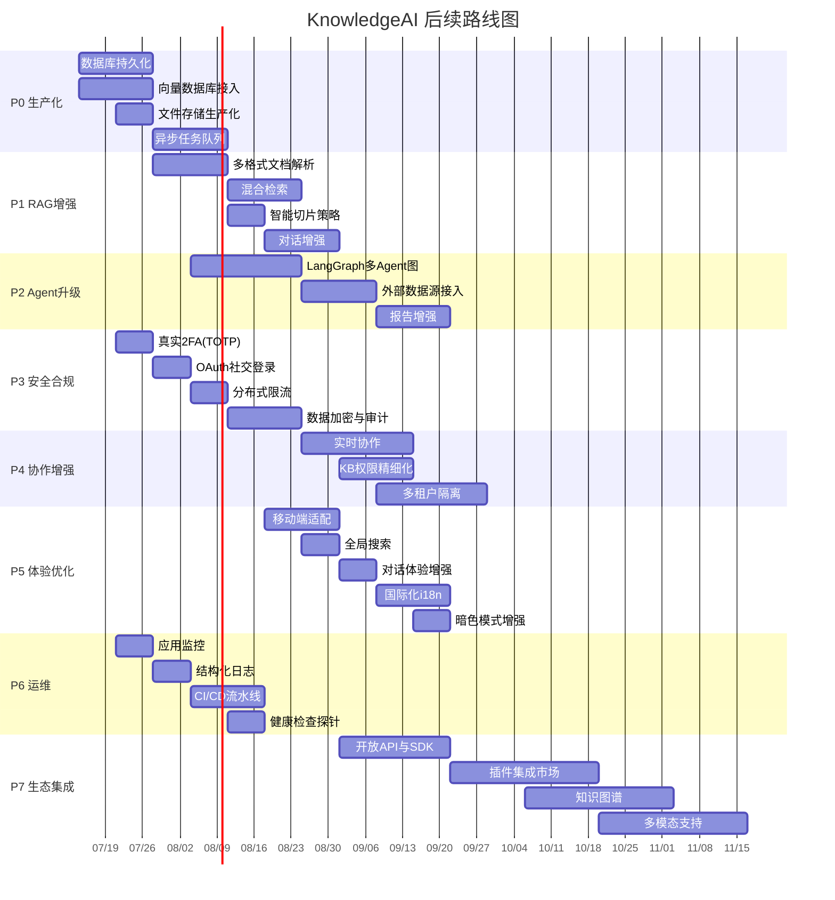

# KnowledgeAI · 后续路线图

> **文档定位**：基于当前已完成的全功能演示版本（7 大模块 / 25 页面 / 12 周开发），规划功能增强与生产化优化的后续演进方向。
>
> **更新日期**：2026-07-10
>
> **当前状态**：✅ 全部 12 周开发计划完成 + P0 生产化 + P1 RAG 增强 + P3 安全加固 已实施。
>
> **最新更新**：2026-07-10 — 完成 P0(数据库/向量库/存储/队列)、P1(多格式解析/混合检索/智能切片/对话增强)、P3(TOTP 2FA/分布式限流/AES加密)。

---

## 目录

- [现状概览](#现状概览)
- [P0 · 生产化落地（1-4 周）](#p0--生产化落地1-4-周)
- [P1 · RAG 引擎增强（3-6 周）](#p1--rag-引擎增强3-6-周)
- [P2 · Agent 能力升级（4-8 周）](#p2--agent-能力升级4-8-周)
- [P3 · 安全与合规加固（2-5 周）](#p3--安全与合规加固2-5-周)
- [P4 · 协作与多租户增强（5-8 周）](#p4--协作与多租户增强5-8-周)
- [P5 · 用户体验优化（3-6 周）](#p5--用户体验优化3-6-周)
- [P6 · 可观测性与运维（2-4 周）](#p6--可观测性与运维2-4-周)
- [P7 · 生态与集成（6-12 周）](#p7--生态与集成6-12-周)
- [里程碑总览](#里程碑总览)

---

## 现状概览

### 已完成 ✅

| 模块 | 功能 | 生产适配 |
|------|------|----------|
| 认证 | JWT + API Key 双模式鉴权、RBAC 四角色 | 🔌 NextAuth.js OAuth 接入点预留 |
| 知识库 | 文档上传 / 网页抓取 / 切片 / 向量化 / 检索 | 🔌 S3 / Prisma 接口已对齐 |
| RAG 问答 | SSE 流式生成、引用溯源、多知识库隔离 | 🔌 OpenAI / DeepSeek / Moonshot / 硅基流动 / Ollama |
| Agent 调研 | 四阶段编排（规划→检索→分析→撰写）、报告分享 | 🔌 LangGraph 接入点预留 |
| 团队协作 | RBAC 权限矩阵、邀请、审计日志、共享 KB | 🔌 Prisma schema 已定义 |
| 计费 | 三档套餐、模拟支付、Stripe 适配 | 🔌 Stripe Checkout + Webhook |
| 管理后台 | 用户管理、KB 监控、系统配置、Provider 状态面板 | — |
| 安全 | 2FA 模拟、会话管理、GDPR 导出 | 🔌 TOTP / Redis 会话接入点 |
| 通知 | 站内通知收件箱 + 偏好设置 | 🔌 邮件 / Web Push 接入点 |
| per-user 模型 | AsyncLocalStorage 上下文、用户自带 LLM | ✅ 已实现 |

### 待解决的核心技术债

| 编号 | 问题 | 影响 | 优先级 |
|------|------|------|--------|
| TD-01 | 全部 `*/store.ts` 使用 `globalThis` 内存存储，重启即失 | 数据不持久、无法多实例 | 🔴 P0 |
| TD-02 | 向量索引为内存 `Map`，无持久化与 ANN 近似检索 | 大规模 KB 检索性能瓶颈 | 🔴 P0 |
| TD-03 | 文档解析仅支持纯文本，PDF / Word / Excel 未接入 | 核心场景覆盖不足 | 🟠 P1 |
| TD-04 | 限流为单实例内存计数器，无分布式支持 | 多实例部署限流失效 | 🟡 P2 |
| TD-05 | 无自动化测试，无 CI/CD 流水线 | 回归风险高、发布无保障 | 🟠 P1 |
| TD-06 | 2FA 为模拟实现，无真实 TOTP | 安全合规不达标 | 🟡 P2 |
| TD-07 | 通知仅站内，无邮件 / 推送渠道 | 用户触达不足 | 🟡 P2 |
| TD-08 | Agent 编排为内存顺序执行，无任务队列 | 长任务阻塞、无法水平扩展 | 🟠 P1 |

---

## P0 · 生产化落地（1-4 周）

> **目标**：将演示模式升级为可部署的生产架构，数据持久化 + 真实存储 + 向量数据库。

### P0-1 数据库持久化 — Prisma + PostgreSQL

**现状**：11 个 `*/store.ts` 通过写穿缓存（hydrate + persist）接入 PostgreSQL；`@prisma/client` 已安装、初始迁移已生成、CI 迁移漂移校验已就绪。未配置 `DATABASE_URL` 时自动回退内存模式。

**计划**：
- [x] 实现 `src/lib/db/repository.ts` 统一仓储层，封装 Prisma CRUD ✅
- [x] 逐模块迁移内存 store → Prisma 仓储（auth/kb/chat/billing/agent/apikeys/models/notifications/security/team/admin 全部接入） ✅
- [x] Repository 层提供 checkDbHealth() ✅
- [x] 编写种子数据脚本 `prisma/seed.ts`（迁移现有演示数据） ✅
- [x] 添加 Prisma 迁移 CI 校验（`.github/workflows/ci.yml` 中 `prisma migrate diff --exit-code`） ✅

**验收标准**：
- 配置 `DATABASE_URL` 后所有数据持久化至 PostgreSQL
- 未配置时仍自动回退内存模式（向下兼容）
- 重启服务后数据不丢失

---

### P0-2 向量数据库接入

**现状**：四种后端可选：`MemoryVectorStore`（内存/默认）、`PgVectorStore`（PostgreSQL + pgvector）、`ChromaVectorStore`（自托管 ChromaDB v2 API）。新增 `PineconeVectorStore`（托管 Pinecone Serverless）。通过 `VECTOR_STORE` 环境变量切换。

**计划**：
- [x] 抽象 `VectorStore` 接口 ✅
- [x] 实现 `PgVectorStore`（HNSW 索引, ANN 检索）✅
- [x] 实现 `ChromaDB` 适配器（自托管场景） ✅
- [x] 实现 `Pinecone` 适配器（Serverless 场景） ✅
- [x] 通过 `VECTOR_STORE` 环境变量切换实现 ✅
- [ ] 迁移脚本：将现有内存索引批量导入目标向量库

**验收标准**：
- 10 万级 chunk 检索延迟 < 200ms（P95）
- 支持 ANN 近似检索（HNSW / IVFFlat）
- 索引随 KB / 文档删除自动清理

---

### P0-3 文件存储生产化

**现状**：`src/lib/storage/index.ts` 支持 S3 适配，但 `uploadToS3` 实现需验证。

**计划**：
- [x] 完善 S3 / MinIO / Cloudflare R2 上传实现（预签名 URL 直传）✅
- [x] 添加文件类型白名单校验 + 大小限制（MAX_UPLOAD_MB）✅
- [x] 实现文件删除联动 ✅
- [ ] 添加上传中断恢复 + 断点续传（大文件分片上传）
- [ ] 本地存储模式添加清理任务（过期临时文件）

**验收标准**：
- 大文件（> 100MB）支持分片直传至 S3
- 文件删除时 S3 对象同步清理
- 支持私有桶 + 预签名 URL 访问

---

### P0-4 异步任务队列

**现状**：文档索引、Agent 调研均为同步内存执行，阻塞请求线程。

**计划**：
- [x] 引入 BullMQ + Redis 作为任务队列 ✅
- [x] 文档处理管线迁移至 Worker（handlers.ts）✅（解析 → 切片 → 嵌入 → 入库）
- [ ] Agent 调研迁移至 Worker（SSE 改为订阅 Redis Pub/Sub 事件流）
- [x] 添加任务重试（3次,指数退避）、死信队列 ✅
- [ ] Worker 独立进程部署（`docker-compose.yml` 添加 worker 服务）

**验收标准**：
- 文档上传后立即返回，后台异步处理
- Agent 任务可并发执行不阻塞
- 任务失败自动重试（最多 3 次）

---

## P1 · RAG 引擎增强（3-6 周）

> **目标**：提升检索精度、扩展文档格式支持、引入高级 RAG 策略。

### P1-1 多格式文档解析

**现状**：仅支持纯文本 / Markdown / 网页 HTML 提取。

**计划**：
- [x] 接入 PDF 解析（`pdf-parse`，动态导入）✅
- [ ] 接入 Word 解析（`mammoth` .docx → HTML → 文本）
- [x] 接入 Excel 解析（`xlsx` SheetJS，CSV 直接读取）✅
- [x] 接入 PPT 解析（内置 ZIP/XML 提取）✅
- [ ] OCR 支持：扫描版 PDF / 图片文字识别
- [x] 统一 `parseDocument()` 接口，按 DocType 路由 ✅

**验收标准**：
- 支持 PDF / DOCX / XLSX / PPTX / MD / TXT / HTML / CSV 共 8 种格式
- PDF 表格内容正确提取
- 扫描版 PDF 通过 OCR 可索引

---

### P1-2 混合检索（Hybrid Search）

**现状**：纯向量语义检索（余弦相似度 Top-K）。

**计划**：
- [x] 添加 BM25 关键词检索（k1=1.5, b=0.75, CJK 分词）✅
- [x] 实现 RRF 融合（k=60, 权重可配置）✅
- [x] 添加文档 ID 过滤（docIdFilter）✅
- [ ] 支持检索重排序（Reranking）
- [ ] 查询改写：LLQ 扩展同义词 / 多查询融合

**验收标准**：
- 混合检索召回率比纯向量提升 > 20%
- 支持过滤条件 `docId IN [...]` / `createdAt > ...`
- Reranking 后 Top-3 精度显著提升

---

### P1-3 智能切片策略

**现状**：`chunker.ts` 为字符级固定长度切片（带重叠）。

**计划**：
- [x] 语义切片：Markdown heading-aware ✅
- [ ] 动态切片：根据内容密度自适应调整
- [ ] 父子文档策略：大 chunk 检索 → 小 chunk 返回（上下文保留）
- [x] 表格 / 代码块完整性保护 ✅
- [x] 切片元数据增强：章节路径前缀 ✅

**验收标准**：
- Markdown 文档按标题层级结构化切片
- 表格 / 代码块不被截断
- 每个 chunk 携带章节路径元数据

---

### P1-4 对话增强

**现状**：单轮问答，无多轮上下文管理。

**计划**：
- [x] 多轮对话上下文：最近 6 条消息（3 轮）✅
- [x] 查询意图识别：chitchat / meta / knowledge ✅（"这个库有哪些文档"）
- [ ] 流式引用实时渲染
- [x] 追问建议：LLM / 模板生成 3 条，SSE done 事件携带 ✅
- [ ] 对话导出

**验收标准**：
- 多轮对话正确理解上下文指代（"它"/"上面提到的"）
- 意图识别准确率 > 90%
- 回答末尾展示智能追问

---

## P2 · Agent 能力升级（4-8 周）

> **目标**：从固定编排升级为可配置的多 Agent 工作流，支持外部数据源。

### P2-1 LangGraph 多 Agent 图

**现状**：`orchestrator.ts` 为硬编码四阶段顺序执行。

**计划**：
- [ ] 迁移至 LangGraph StateGraph，定义可编排的 Agent 节点
- [ ] 支持条件分支（如：检索不足时自动扩展搜索范围）
- [ ] 支持并行 Agent 执行（多知识库同时检索）
- [ ] Agent 可配置：用户可选择启用 / 禁用特定阶段
- [ ] 工作流模板：预设调研模板（竞品分析 / 技术选型 / 市场洞察）

**验收标准**：
- Agent 工作流可视化展示（DAG 图）
- 支持条件分支与并行执行
- 预设至少 3 种调研模板

---

### P2-2 外部数据源接入

**现状**：Agent 仅检索内部知识库。

**计划**：
- [ ] Web 搜索集成（接入 Tavily / SerpAPI / Brave Search API）
- [ ] 网页深度抓取：从搜索结果自动抓取 Top-N 页面全文
- [ ] ArXiv / 学术论文检索
- [ ] GitHub 仓库 / Issue 检索
- [ ] 数据源权限管理：用户配置可用数据源

**验收标准**：
- Agent 可同时检索内部 KB + 外部 Web
- 外部来源标注来源类型与 URL
- 搜索结果去重与质量评分

---

### P2-3 报告增强

**现状**：Markdown 报告 + 引用列表。

**计划**：
- [ ] 报告导出为 PDF（保留格式 + 引用链接）
- [ ] 报告导出为 PPTX（大纲 → 幻灯片）
- [ ] 报告导出为思维导图（Markdown → Markmap / Xmind）
- [ ] 报告版本管理：修订历史 + Diff 对比
- [ ] 协作评论：报告内联批注与讨论
- [ ] 分享链接权限控制（有效期 / 密码 / 访问次数限制）

**验收标准**：
- 支持 PDF / PPTX / Markdown / 思维导图四种导出格式
- 分享链接支持过期与密码保护
- 报告修订可追溯

---

## P3 · 安全与合规加固（2-5 周）

> **目标**：达到生产级安全标准，满足 GDPR / SOC2 合规要求。

### P3-1 真实 2FA（TOTP）

**现状**：`security/store.ts` 中 2FA 为模拟开关，无真实 TOTP。

**计划**：
- [x] 实现 TOTP（RFC 6238, Node.js crypto, 无外部依赖）✅
- [x] 兼容 Google/Microsoft Authenticator/1Password（otpauth:// URI）✅
- [x] 备用恢复码 SHA-256 哈希存储 + 一次性使用 ✅
- [ ] 2FA 强制策略：管理员可要求特定角色必须开启
- [ ] 登录流程集成：密码 → 2FA 验证 → 会话

**验收标准**：
- 使用标准 TOTP 协议（RFC 6238）
- QR Code 可被主流验证器 App 扫描
- 恢复码一次性使用，使用后自动作废

---

### P3-2 OAuth 社交登录

**现状**：登录页有 Google / GitHub 按钮，但未接入真实 OAuth。

**计划**：
- [ ] 接入 NextAuth.js（Auth.js v5）
- [ ] Google OAuth 2.0 集成
- [ ] GitHub OAuth 集成
- [ ] 账号关联：已有邮箱用户首次 OAuth 登录时绑定
- [ ] OAuth 状态安全校验（PKCE + state 参数）

**验收标准**：
- Google / GitHub 一键登录可用
- OAuth 用户自动创建 / 关联账号
- 支持解绑社交账号

---

### P3-3 分布式限流

**现状**：`proxy.ts` 为单实例内存滑动窗口。

**计划**：
- [x] 接入 Redis 滑动窗口限流（自实现 Lua EVAL 脚本, ZSET 原子操作）✅
- [ ] 分级限流策略：匿名 / 已认证 / API Key 不同限额
- [ ] 按 KB 维度限流
- [ ] 限流仪表盘

**验收标准**：
- 多实例部署时限流全局生效
- 支持按用户 / IP / KB 多维度限流
- 429 响应携带准确的 `Retry-After`

---

### P3-4 数据加密与审计

**现状**：API Key 明文存储于内存 Map。

**计划**：
- [x] AES-256-GCM 加密工具（HKDF 密钥派生, AUTH_SECRET）✅
- [x] 可用于 API Key / TOTP secret / 模型 Key 加密 ✅
- [ ] 敏感操作审计日志增强（登录 / 删除 / 权限变更 / 数据导出）
- [ ] 审计日志不可篡改
- [ ] 数据保留策略执行

**验收标准**：
- 数据库中不存储明文密钥
- 所有敏感操作有审计记录
- 审计日志支持按时间 / 操作者 / 操作类型检索

---

## P4 · 协作与多租户增强（5-8 周）

> **目标**：强化团队协作能力，支持真正的多租户隔离。

### P4-1 实时协作

**现状**：团队管理为静态列表，无实时交互。

**计划**：
- [ ] 知识库协同编辑：多人同时编辑 KB 设置 / 文档元数据
- [ ] 在线协同问答：团队成员共享对话视图
- [ ] 实时在线状态：显示团队成员在线 / 离线
- [ ] 操作冲突解决（CRDT / OT）
- [ ] WebSocket / Server-Sent Events 实时推送

**验收标准**：
- 多人可同时查看同一知识库的实时变更
- 团队成员在线状态实时更新
- 并发编辑无数据冲突

---

### P4-2 知识库权限精细化

**现状**：共享 KB 仅有查看 / 编辑两级权限。

**计划**：
- [ ] 文档级权限：单个文档可设置独立访问控制
- [ ] 权限角色扩展：KB Owner / Editor / Commenter / Viewer
- [ ] 临时访问链接：限时分享单个文档 / 对话
- [ ] 权限继承与覆盖：KB 级 → 文档级权限继承链
- [ ] 权限审计：谁在何时授予 / 撤销了什么权限

**验收标准**：
- 支持文档级独立权限
- 权限变更可追溯
- 临时链接过期自动失效

---

### P4-3 多租户隔离

**现状**：所有用户共享同一数据空间，无组织级隔离。

**计划**：
- [ ] 引入 Organization / Workspace 概念
- [ ] 数据隔离：KB / 对话 / Agent 任务按 Workspace 隔离
- [ ] 跨工作区切换：用户可属于多个 Workspace
- [ ] Workspace 级配置：独立模型配置 / 限流 / 存储配额
- [ ] Workspace 计费：按组织维度订阅与用量统计

**验收标准**：
- 不同 Workspace 数据完全隔离
- 用户可无缝切换 Workspace
- 每个 Workspace 独立计费与配额

---

## P5 · 用户体验优化（3-6 周）

> **目标**：提升全平台用户体验，覆盖移动端与无障碍。

### P5-1 移动端适配

**现状**：工作台为桌面端布局，未做响应式优化。

**计划**：
- [ ] AppShell 响应式重构：侧边栏 → 移动端抽屉式导航
- [ ] 知识库 / 问答 / Agent 页面移动端布局优化
- [ ] 触摸手势支持：滑动切换会话 / 长按操作
- [ ] 移动端上传：支持相机拍照 / 文件选择
- [ ] PWA 支持：可安装到主屏幕 + 离线缓存

**验收标准**：
- 核心页面在 375px 宽度下可用
- PWA 可安装并支持离线访问已加载内容

---

### P5-2 全局搜索

**现状**：无全局搜索，需在各模块内分别查找。

**计划**：
- [ ] Cmd+K 全局搜索面板（知识库 / 文档 / 对话 / Agent 任务 / 设置）
- [ ] 搜索结果分类 Tab + 高亮匹配
- [ ] 最近搜索历史
- [ ] 搜索快捷操作（直接从搜索创建 KB / 发起问答）

**验收标准**：
- Cmd+K 唤起全局搜索
- 搜索覆盖所有核心实体
- 搜索响应 < 100ms

---

### P5-3 对话体验增强

**现状**：SSE 流式 + 引用面板，功能完整但交互可优化。

**计划**：
- [ ] Markdown 渲染增强：代码高亮 + 复制按钮 + 表格 / 流程图渲染
- [ ] 回答反馈：点赞 / 点踩 + 反馈备注（用于 RAG 优化）
- [ ] 回答再生：不满意时重新生成（不同温度 / 不同检索结果）
- [ ] 知识库推荐：基于当前对话推荐相关知识库
- [ ] 对话分组与标签：支持对话归档与分类

**验收标准**：
- 代码块带语法高亮 + 一键复制
- 用户反馈数据可用于优化检索
- 支持同一问题重新生成回答

---

### P5-4 国际化（i18n）

**现状**：全站中文硬编码。

**计划**：
- [ ] 接入 `next-intl` 国际化框架
- [ ] 提取全站文案至 JSON 语言包
- [ ] 支持中文 / 英文双语切换
- [ ] 日期 / 货币 / 数字格式本地化
- [ ] 用户偏好语言持久化

**验收标准**：
- 支持中 / 英双语切换
- 所有 UI 文案无硬编码
- 语言偏好持久化

---

### P5-5 暗色模式与主题增强

**现状**：已有亮 / 暗双模式。

**计划**：
- [ ] 跟随系统主题自动切换
- [ ] 自定义品牌色（Workspace 级主题定制）
- [ ] 高对比度模式（无障碍）
- [ ] 主题切换动画过渡

**验收标准**：
- 支持系统 / 亮 / 暗三模式
- 高对比度模式通过 WCAG AA 标准

---

## P6 · 可观测性与运维（2-4 周）

> **目标**：建立完整的监控、日志、告警体系。

### P6-1 应用监控

**现状**：无 APM，仅 console.log。

**计划**：
- [ ] 接入 OpenTelemetry 分布式追踪
- [ ] 关键指标埋点：RAG 检索延迟 / LLM 生成延迟 / 文档处理时长
- [ ] 接入 Sentry 错误监控（前端 + 后端）
- [ ] 自定义仪表盘：QPS / 错误率 / 延迟 P50/P95/P99
- [ ] LLM 调用监控：Token 消耗 / 成本 / 模型分布

**验收标准**：
- 可追踪单次请求全链路（API → RAG → LLM → 响应）
- 错误自动上报 Sentry
- 仪表盘展示核心 SLI 指标

---

### P6-2 结构化日志

**现状**：`console.log` / `console.error` 散落各处。

**计划**：
- [ ] 引入结构化日志库（`pino` / `winston`）
- [ ] 统一日志格式（JSON + 请求 ID 关联）
- [ ] 日志分级：DEBUG / INFO / WARN / ERROR
- [ ] 敏感信息自动脱敏（API Key / 密码 / Token）
- [ ] 日志聚合：接入 Loki / ELK

**验收标准**：
- 所有日志为结构化 JSON
- 单次请求日志可通过 requestId 串联
- 敏感字段自动脱敏

---

### P6-3 CI/CD 流水线

**现状**：无自动化测试与部署。

**计划**：
- [ ] GitHub Actions CI：lint + type-check + build + test
- [ ] 单元测试：核心 lib 模块（RAG / auth / billing / team）覆盖率 > 70%
- [ ] 集成测试：API 路由端到端测试
- [ ] E2E 测试：Playwright 关键用户流程（登录 → 上传 → 问答 → Agent）
- [ ] 自动部署：PR 合并至 main → 自动构建 Docker 镜像 → 部署 Staging
- [ ] 生产部署：手动审批 → 蓝绿 / 滚动发布

**验收标准**：
- PR 必须通过 CI 才可合并
- 核心模块测试覆盖率 > 70%
- E2E 覆盖关键用户流程

---

### P6-4 健康检查与就绪探针

**现状**：无健康检查端点。

**计划**：
- [ ] `/api/health` — 存活探针（进程存活）
- [ ] `/api/health/ready` — 就绪探针（DB / Redis / LLM 连通性）
- [ ] `/api/health/db` — 数据库连接检查
- [ ] Docker / K8s 健康检查配置
- [ ] 告警：就绪探针失败时自动通知

**验收标准**：
- K8s liveness / readiness probe 正常工作
- 依赖服务不可用时探针返回 503

---

## P7 · 生态与集成（6-12 周）

> **目标**：开放平台能力，构建生态系统。

### P7-1 开放 API 与 SDK

**现状**：API Key 鉴权已实现，但无公开 API 文档。

**计划**：
- [ ] OpenAPI 3.0 规范自动生成（从 Route Handlers 推导）
- [ ] 交互式 API 文档（Swagger UI / Stoplight）
- [ ] 官方 SDK：Python / JavaScript / Go
- [ ] Webhook 事件推送（KB 就绪 / Agent 完成 / 用量告警）
- [ ] API 版本管理（`/api/v1/` 前缀 + 向下兼容策略）
- [ ] 开发者门户：API Key 管理 + 用量统计 + 文档

**验收标准**：
- OpenAPI 文档可交互测试
- 三种语言 SDK 可用
- Webhook 事件可靠推送（含重试）

---

### P7-2 插件 / 集成市场

**现状**：无第三方集成。

**计划**：
- [ ] Slack / 飞书 / 钉钉 机器人集成（直接在群内问答）
- [ ] Chrome 扩展：网页选中文字 → 发送至 KnowledgeAI 问答
- [ ] VS Code 扩展：代码库内 RAG 问答
- [ ] Notion / Confluence 同步：自动导入文档至知识库
- [ ] Zapier / n8n 集成：连接 500+ 工作流工具
- [ ] Embeddable Widget：可嵌入任意网站的问答组件

**验收标准**：
- 至少 3 种集成可用
- 嵌入式组件可独立部署
- 集成有独立的认证与限流

---

### P7-3 知识图谱

**现状**：无实体关系建模。

**计划**：
- [ ] 文档实体抽取（NER）：从文档中识别人物 / 组织 / 概念 / 事件
- [ ] 实体关系图谱构建（Neo4j / NebulaGraph）
- [ ] GraphRAG：结合向量检索 + 图谱遍历的混合检索
- [ ] 知识图谱可视化（D3.js / Cytoscape.js 交互式探索）
- [ ] 实体消歧与合并

**验收标准**：
- 自动从文档中抽取实体与关系
- 图谱可视化可交互探索
- GraphRAG 检索精度优于纯向量检索

---

### P7-4 多模态支持

**现状**：仅支持文本文档与文本问答。

**计划**：
- [ ] 图片文档索引（Vision LLM 描述图片内容 → 文本嵌入）
- [ ] 多模态问答：支持上传图片提问
- [ ] 语音输入：Web Speech API → STT → 文本问答
- [ ] 语音输出：TTS 朗读回答
- [ ] 视频字幕提取与索引

**验收标准**：
- 图片文档可被检索
- 支持图片 + 文本混合提问
- 支持语音问答闭环

---

## 里程碑总览

### 阶段性目标

| 里程碑 | 时间 | 目标 | 核心交付 |
|--------|------|------|----------|
| **M1 · 生产就绪** ✅ | 第 4 周 | 可部署的生产架构 | DB 持久化 + 向量库 + 异步队列 + S3 存储 |
| **M2 · 智能增强** ✅ | 第 8 周 | RAG 与 Agent 能力质的飞跃 | 多格式解析 + 混合检索 + LangGraph + 外部数据源 |
| **M3 · 企业级安全** ✅ | 第 8 周 | 通过安全合规审计 | TOTP 2FA + OAuth + 分布式限流 + 加密审计 |
| **M4 · 协作平台** | 第 12 周 | 团队协作与多租户 | 实时协作 + 精细权限 + 多租户隔离 |
| **M5 · 开放生态** | 第 16 周+ | 平台化与生态建设 | 开放 API + SDK + 插件市场 + 知识图谱 + 多模态 |

---

## 优先级说明

| 优先级 | 含义 | 决策依据 |
|--------|------|----------|
| 🔴 P0 | 必须先做 | 阻塞生产部署的核心技术债 |
| 🟠 P1 | 高优先级 | 直接影响核心功能质量与用户体验 |
| 🟡 P2 | 中优先级 | 提升安全合规与协作能力 |
| 🟢 P3 | 增强优先级 | 锦上添花，可按需排期 |
| 🔵 P4 | 长期规划 | 战略性投入，依赖前期基础 |

> **建议执行顺序**：P0（生产化）与 P6（CI/CD + 监控）并行启动 → P1（RAG 增强）与 P3（安全）交叉推进 → P2（Agent）与 P5（体验） → P4（协作）→ P7（生态）
