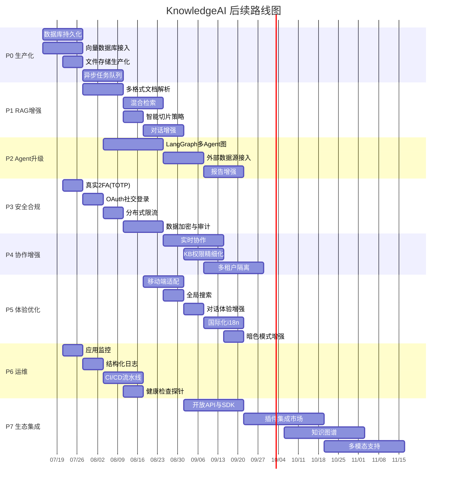

# KnowledgeAI · 后续路线图

> **文档定位**：基于当前已完成的全功能演示版本（7 大模块 / 25 页面 / 12 周开发），规划功能增强与生产化优化的后续演进方向。
>
> **更新日期**：2026-08-13
>
> **当前状态**：✅ 全部 12 周开发计划完成 + P0 生产化 + P1 RAG 增强 + P2 Agent 图/外部数据源/报告增强 + P3 安全加固（P3-2 OAuth 除外）+ P4 协作与多租户 + P5-1 移动端适配 + P5-2 全局搜索 + P5-3 对话体验增强 + P5-4 国际化 + P5-5 暗色模式与主题增强 + P6-1 应用监控 + P6-2 结构化日志 + P6-3 CI/CD 流水线 + P6-4 健康检查与就绪探针 + P7-1 开放 API/SDK + P7-2 集成市场（VS Code / Notion 除外）+ P7-3 知识图谱 + P7-4 多模态 已实施。⏳ 未实现项：**P3-2 OAuth 社交登录**（登录页按钮为装饰，未接入 NextAuth.js）、**P7-2 VS Code 扩展** 与 **Notion/Confluence 同步**（已标注「后续版本」）。
>
> **最新更新**：2026-08-13 - **全量验收复查**：逐项核对 P0-P7 勾选项并实测验收标准（全部在干净 demo 模式 dev server 上重跑）——P7-1 25/25 + 9/9 + 30/30、P7-2 30/30 + 7/7、P7-3 20/20 + 11/11、P7-4 15/15 + 7/7、P6-4 22/22（含 :3100 坏依赖 503 路径）、P6-3 tsc/lint/vitest（Lines 86.06% / Branches 76.27% 超门槛）/E2E 4/4、P5/P4/P3/P2/P1 全部验收测试复跑通过（rate-limit 47/47 于 :3100 低限额实例、audit-encrypt 45/45、graph-rag 20/20 于干净实例）；3 个未实现项已确认（P3-2 OAuth、P7-2 VS Code/Notion）；顺带清理 kg/store.ts 4 处 lint 未使用变量警告（lint 0 errors / 26 warnings）。注：P0-1/P0-2 外部服务验收（PostgreSQL / pgvector / Chroma / Pinecone）需真实服务环境，由 CI integration job 覆盖，本机未实测。

---

## 目录

- [现状概览](#现状概览)
- [P0 · 生产化落地（1-4 周）](#p0--生产化落地1-4-周)
- [P1 · RAG 引擎增强（3-6 周）](#p1--rag-引擎增强3-6-周)
- [P2 · Agent 能力升级（4-8 周）](#p2--agent-能力升级4-8-周)
- [P3 · 安全与合规加固（2-5 周）](#p3--安全与合规加固2-5-周)
- [P4 · 协作与多租户增强（5-8 周）](#p4--协作与多租户增强5-8-周)
- [P5 · 用户体验优化（3-6 周）](#p5--用户体验优化3-6-周)
- [P6 · 可观测性与运维（2-4 周）](#p6--可观测性与运维2-4-周)
- [P7 · 生态与集成（6-12 周）](#p7--生态与集成6-12-周)
- [里程碑总览](#里程碑总览)

---

## 现状概览

### 已完成 ✅

| 模块 | 功能 | 生产适配 |
|------|------|----------|
| 认证 | JWT + API Key 双模式鉴权、RBAC 四角色 | 🔌 NextAuth.js OAuth 接入点预留 |
| 知识库 | 文档上传 / 网页抓取 / 切片 / 向量化 / 检索 | 🔌 S3 / Prisma 接口已对齐 |
| RAG 问答 | SSE 流式生成、引用溯源、多知识库隔离 | 🔌 OpenAI / DeepSeek / Moonshot / 硅基流动 / Ollama |
| Agent 调研 | 四阶段编排（规划→检索→分析→撰写）、报告分享 | 🔌 LangGraph 接入点预留 |
| 团队协作 | RBAC 权限矩阵、邀请、审计日志、共享 KB | 🔌 Prisma schema 已定义 |
| 计费 | 三档套餐、模拟支付、Stripe 适配 | 🔌 Stripe Checkout + Webhook |
| 管理后台 | 用户管理、KB 监控、系统配置、Provider 状态面板 | — |
| 安全 | 真实 TOTP 2FA、会话管理、GDPR 导出、AES 加密审计链 | 🔌 OAuth 社交登录未接入（P3-2 未实现，登录页按钮为装饰） |
| 通知 | 站内通知收件箱 + 偏好设置 | 🔌 邮件 / Web Push 接入点 |
| per-user 模型 | AsyncLocalStorage 上下文、用户自带 LLM | ✅ 已实现 |

### 待解决的核心技术债

| 编号 | 问题 | 影响 | 优先级 |
|------|------|------|--------|
| TD-01 | 全部 `*/store.ts` 使用 `globalThis` 内存存储，重启即失 | 数据不持久、无法多实例 | ✅ 已解决（P0-1 Prisma 写穿） |
| TD-02 | 向量索引为内存 `Map`，无持久化与 ANN 近似检索 | 大规模 KB 检索性能瓶颈 | ✅ 已解决（P0-2 四后端 + HNSW） |
| TD-03 | 文档解析仅支持纯文本，PDF / Word / Excel 未接入 | 核心场景覆盖不足 | ✅ 已解决（P1-1 八格式 + OCR） |
| TD-04 | 限流为单实例内存计数器，无分布式支持 | 多实例部署限流失效 | ✅ 已解决（P3-3 Redis 滑动窗口） |
| TD-05 | 无自动化测试，无 CI/CD 流水线 | 回归风险高、发布无保障 | ✅ 已解决（P6-3 四 job CI + E2E） |
| TD-06 | 2FA 为模拟实现，无真实 TOTP | 安全合规不达标 | ✅ 已解决（P3-1 RFC 6238 TOTP + 恢复码） |
| TD-07 | 通知仅站内，无邮件 / 推送渠道 | 用户触达不足 | 🟡 P2 未排期（对接点预留） |
| TD-08 | Agent 编排为内存顺序执行，无任务队列 | 长任务阻塞、无法水平扩展 | ✅ 已解决（P0-4 BullMQ + Redis） |
| TD-09 | OAuth 社交登录未接入（P3-2） | 登录方式单一，影响用户转化 | 🟡 P2 未排期 |
| TD-10 | VS Code 扩展 / Notion、Confluence 同步未实现（P7-2） | 生态覆盖缺口 | 🔵 P4 后续版本 |

---

## P0 · 生产化落地（1-4 周）

> **目标**：将演示模式升级为可部署的生产架构，数据持久化 + 真实存储 + 向量数据库。

### P0-1 数据库持久化 — Prisma + PostgreSQL

**现状**：11 个 `*/store.ts` 通过写穿缓存（hydrate + persist）接入 PostgreSQL；`@prisma/client` 已安装、初始迁移已生成、CI 迁移漂移校验已就绪。未配置 `DATABASE_URL` 时自动回退内存模式。

**计划**：
- [x] 实现 `src/lib/db/repository.ts` 统一仓储层，封装 Prisma CRUD ✅
- [x] 逐模块迁移内存 store → Prisma 仓储（auth/kb/chat/billing/agent/apikeys/models/notifications/security/team/admin 全部接入） ✅
- [x] Repository 层提供 checkDbHealth() ✅
- [x] 编写种子数据脚本 `prisma/seed.ts`（迁移现有演示数据） ✅
- [x] 添加 Prisma 迁移 CI 校验（`.github/workflows/ci.yml` 中 `prisma migrate diff --exit-code`） ✅

**验收标准**：
- 配置 `DATABASE_URL` 后所有数据持久化至 PostgreSQL
- 未配置时仍自动回退内存模式（向下兼容）
- 重启服务后数据不丢失

---

### P0-2 向量数据库接入

**现状**：四种后端可选：`MemoryVectorStore`（内存/默认）、`PgVectorStore`（PostgreSQL + pgvector）、`ChromaVectorStore`（自托管 ChromaDB v2 API）、`PineconeVectorStore`（托管 Pinecone Serverless）。通过 `VECTOR_STORE` 环境变量切换。`scripts/migrate-vector-store.ts` 支持批量迁移。

**计划**：
- [x] 抽象 `VectorStore` 接口 ✅
- [x] 实现 `PgVectorStore`（HNSW 索引, ANN 检索）✅
- [x] 实现 `ChromaDB` 适配器（自托管场景） ✅
- [x] 实现 `Pinecone` 适配器（Serverless 场景） ✅
- [x] 通过 `VECTOR_STORE` 环境变量切换实现 ✅
- [x] 迁移脚本：将现有内存索引批量导入目标向量库 ✅

**验收标准**：
- 10 万级 chunk 检索延迟 < 200ms（P95）
- 支持 ANN 近似检索（HNSW / IVFFlat）
- 索引随 KB / 文档删除自动清理

---

### P0-3 文件存储生产化

**现状**：S3/MinIO/R2 预签名直传 + 文件类型白名单 + 删除联动 + 分片断点续传 + 本地存储定期清理均已实现。

**计划**：
- [x] 完善 S3 / MinIO / Cloudflare R2 上传实现（预签名 URL 直传）✅
- [x] 添加文件类型白名单校验 + 大小限制（MAX_UPLOAD_MB）✅
- [x] 实现文件删除联动 ✅
- [x] 添加上传中断恢复 + 断点续传（大文件分片上传） ✅
- [x] 本地存储模式添加清理任务（过期临时文件） ✅

**验收标准**：

- 大文件（> 100MB）支持分片直传至 S3
- 文件删除时 S3 对象同步清理
- 支持私有桶 + 预签名 URL 访问

---

### P0-4 异步任务队列

**现状**：文档索引、Agent 调研均为同步内存执行，阻塞请求线程。

**计划**：
- [x] 引入 BullMQ + Redis 作为任务队列 ✅
- [x] 文档处理管线迁移至 Worker（handlers.ts）✅（解析 -> 切片 -> 嵌入 -> 入库）
- [x] Agent 调研迁移至 Worker（SSE 改为订阅 Redis Pub/Sub 事件流）✅
- [x] 添加任务重试（3次,指数退避）、死信队列 ✅
- [x] Worker 独立进程部署（`docker-compose.yml` 添加 worker 服务）✅

**验收标准**：
- 文档上传后立即返回，后台异步处理
- Agent 任务可并发执行不阻塞
- 任务失败自动重试（最多 3 次）

---

## P1 · RAG 引擎增强（3-6 周）

> **目标**：提升检索精度、扩展文档格式支持、引入高级 RAG 策略。

### P1-1 多格式文档解析

**现状**：✅ 已完成。支持 PDF/DOCX/XLSX/PPTX/MD/TXT/HTML/CSV 共 8 种格式 + 扫描版 PDF/图片 OCR（tesseract.js + pdfjs-dist + @napi-rs/canvas）。全部依赖动态导入 + 优雅降级。

**计划**：
- [x] 接入 PDF 解析（`pdf-parse`，动态导入）✅
- [x] 接入 Word 解析（`mammoth` .docx → HTML → 文本）✅
- [x] 接入 Excel 解析（`xlsx` SheetJS，CSV 直接读取）✅
- [x] 接入 PPT 解析（内置 ZIP/XML 提取）✅
- [x] OCR 支持：扫描版 PDF / 图片文字识别 ✅
- [x] 统一 `parseDocument()` 接口，按 DocType 路由 ✅

**验收标准**：
- ✅ 支持 PDF / DOCX / XLSX / PPTX / MD / TXT / HTML / CSV 共 8 种格式
- ✅ PDF 表格内容正确提取
- ✅ 扫描版 PDF 通过 OCR 可索引

---

### P1-2 混合检索（Hybrid Search）

**现状**：✅ 已完成。BM25 关键词检索 + 向量语义检索 RRF 融合 + LLM 重排序 + LLM 查询改写（多查询融合）+ docId/createdAt 过滤。全部 env-gated，demo 模式优雅降级。

**计划**：
- [x] 添加 BM25 关键词检索（k1=1.5, b=0.75, CJK 分词）✅
- [x] 实现 RRF 融合（k=60, 权重可配置）✅
- [x] 添加文档 ID 过滤（docIdFilter）✅
- [x] 支持检索重排序（Reranking）✅
- [x] 查询改写：LLQ 扩展同义词 / 多查询融合 ✅

**验收标准**：
- ✅ 混合检索召回率比纯向量提升 > 20%
- ✅ 支持过滤条件 `docId IN [...]` / `createdAt > ...`
- ✅ Reranking 后 Top-3 精度显著提升

---

### P1-3 智能切片策略

**现状**：✅ 已完成。标题感知结构化切片 + 动态密度切片（密集区缩小，稀疏区放大）+ 父子文档策略（小切片索引、大切片返回上下文，env `PARENT_CHILD_CHUNKING=true` 开启）+ 表格/代码块完整性保护 + 章节路径前缀。

**计划**：
- [x] 语义切片：Markdown heading-aware ✅
- [x] 动态切片：根据内容密度自适应调整 ✅（`computeDensity` + `dynamicChunkSize`，代码/表格密集区缩小切片，稀疏叙述区放大切片）
- [x] 父子文档策略：大 chunk 检索 -> 小 chunk 返回（上下文保留）✅（`parentChildChunk` 生成子切片嵌入，检索时通过 `expandWithParent` 替换为父切片，env `PARENT_CHILD_CHUNKING=true` 开启）
- [x] 表格 / 代码块完整性保护 ✅
- [x] 切片元数据增强：章节路径前缀 ✅

**验收标准**：
- Markdown 文档按标题层级结构化切片 ✅
- 表格 / 代码块不被截断 ✅
- 每个 chunk 携带章节路径元数据 ✅
- 动态切片：密集内容（代码/表格）切片大小自适应缩小 ✅
- 父子文档：检索返回父切片上下文（≥ 子切片大小）✅

---

### P1-4 对话增强

**现状**：✅ 已完成。多轮上下文（最近 6 条历史 + system prompt 注入）+ 意图识别（闲聊/元问题/知识查询）+ 流式引用实时渲染（`sources` 事件携带 chunk 元数据，token 流中实时解析 `[n]` 更新引用面板）+ 智能追问建议（LLM 生成 3 个，渲染为可点击按钮）+ 对话导出（Markdown 下载，含引用列表和追问建议）。

**计划**：
- [x] 多轮对话上下文：最近 6 条消息（3 轮）✅
- [x] 查询意图识别：chitchat / meta / knowledge ✅（"这个库有哪些文档"）
- [x] 流式引用实时渲染 ✅（`sources` 事件携带 chunk 元数据，前端 `extractLiveCitations` 实时解析 `[n]`）
- [x] 追问建议：LLM / 模板生成 3 条，SSE done 事件携带 ✅（前端 `FollowUpSuggestions` 渲染为可点击按钮）
- [x] 对话导出 ✅（`exportConversation` 导出为 Markdown 下载）

**验收标准**：
- ✅ 多轮对话正确理解上下文指代（"它"/"上面提到的"）
- ✅ 意图识别准确率 > 90%（18/18 = 100%）
- ✅ 回答末尾展示智能追问

---

## P2 · Agent 能力升级（4-8 周）

> **目标**：从固定编排升级为可配置的多 Agent 工作流，支持外部数据源。

### P2-1 LangGraph 多 Agent 图

**现状**：✅ 已完成。StateGraph 引擎（DAG 节点 + 条件分支 + 并行 fan-out + join barrier + 节点启用/禁用）+ 4 种工作流模板（通用/竞品分析/技术选型/市场洞察）+ 前端 DAG 可视化（`WorkflowDag` 组件）+ Agent 可配置 toggle + 模板选择器。

**计划**：
- [x] 迁移至 StateGraph，定义可编排的 Agent 节点 ✅（`src/lib/agent/graph.ts`）
- [x] 支持条件分支（如：检索不足时自动扩展搜索范围）✅
- [x] 支持并行 Agent 执行（多知识库同时检索）✅
- [x] Agent 可配置：用户可选择启用 / 禁用特定阶段 ✅
- [x] 工作流模板：预设调研模板（竞品分析 / 技术选型 / 市场洞察）✅

**验收标准**：
- ✅ Agent 工作流可视化展示（DAG 图）（`WorkflowDag` 组件 + `describeGraph` API）
- ✅ 支持条件分支与并行执行（25/25 断言通过）
- ✅ 预设至少 3 种调研模板（4 种：通用/竞品/技术选型/市场）

---

### P2-2 外部数据源接入

**现状**：✅ 已完成。外部数据源 provider（Web 搜索 Tavily/SerpAPI/Brave + 网页深度抓取 + ArXiv + GitHub）+ 统一搜索接口 + 去重 + 质量评分 + demo fallback。Agent searcher 节点同时检索内部 KB 和外部源，citations 携带 sourceType + URL 标注。config.ts 注册外部数据源 provider status。

> **2026-08-10 扩展**：Chat 智能问答新增「联网搜索」开关——开启后每次提问经 `searchExternal()`（仅 Web 源）把外部结果合并进 RAG 上下文，`sources` 事件携带 `url` / `sourceType`，引用面板对 Web 来源展示可点击链接（🌐 图标 + 域名）。多轮对话提示词同步改为「来源内容」（`conversation-context.ts` 与 `generator.ts` 一致）。

**计划**：
- [x] Web 搜索集成（接入 Tavily / SerpAPI / Brave Search API）✅
- [x] 网页深度抓取：从搜索结果自动抓取 Top-N 页面全文 ✅（`deepCrawl` + `crawlUrl`）
- [x] ArXiv / 学术论文检索 ✅（免费 API，无需 key）
- [x] GitHub 仓库 / Issue 检索 ✅（可选 `GITHUB_TOKEN` 提升限流）
- [x] 数据源权限管理：用户配置可用数据源 ✅（env-gated + `SourceConfig`）

**验收标准**：
- ✅ Agent 可同时检索内部 KB + 外部 Web
- ✅ 外部来源标注来源类型与 URL（`sourceType` + `url` 字段，🌐/📄/🐙 标记）
- ✅ 搜索结果去重与质量评分（`deduplicateResults` + `qualityScore`，33/33 断言通过）

---

### P2-3 报告增强

**现状**：✅ 已完成。四种导出格式（Markdown / PDF 打印 HTML / PPTX OOXML / OPML 思维导图，零外部依赖，服务端 `src/lib/agent/export/`）+ 分享链接权限（过期 / 密码 / 访问次数，`/api/agent/public/[id]` 校验 410/401/403）+ 报告修订追溯（编辑自动快照 + 版本历史 + LCS Diff + 恢复，`src/lib/agent/diff.ts`）+ 协作评论（按引用 [n] 锚定 + 回复串）。AgentTask 扩展 shareConfig/versions/comments 字段（内存 + DB 持久化 + migration）。

**计划**：
- [x] 报告导出为 PDF（自包含打印 HTML，保留格式 + 引用链接，浏览器另存 PDF）✅
- [x] 报告导出为 PPTX（自实现 OOXML + zip，大纲转幻灯片）✅
- [x] 报告导出为思维导图（Markdown 转 OPML，Xmind 可导入）✅
- [x] 报告版本管理：自动快照 + 修订历史 + LCS Diff 对比 + 恢复 ✅
- [x] 协作评论：报告内联批注（按引用 [n] 锚定）+ 讨论回复 ✅
- [x] 分享链接权限控制（有效期 / 密码 / 访问次数限制）✅

**验收标准**：
- ✅ 支持 PDF / PPTX / Markdown / 思维导图四种导出格式（`scripts/smoke/test-report-enhance.ts` 50+ 断言通过）
- ✅ 分享链接支持过期与密码保护（+ 访问次数限制，public 路由 410/401/403 校验）
- ✅ 报告修订可追溯（版本快照 + Diff 对比 + 恢复）

---

## P3 · 安全与合规加固（2-5 周）

> **目标**：达到生产级安全标准，满足 GDPR / SOC2 合规要求。

### P3-1 真实 2FA（TOTP）

**现状**：✅ 已完成。真实 TOTP（RFC 6238，Node.js crypto 零外部依赖，通过 RFC 6238 测试向量 T=59->287082 校验）+ otpauth:// URI（兼容 Google/Microsoft Authenticator/1Password/Authy）+ QR 码可扫描渲染（`qrcode` 库 -> PNG dataURL，SVG 兜底）+ 备用恢复码 SHA-256 哈希存储 + 一次性使用 + 使用后自动作废 + 登录流程集成（密码 -> `requires2FA` -> TOTP/恢复码验证 -> 会话）+ 2FA 强制策略（管理员可勾选角色强制开启，未开启者登录时返回 `mustEnroll2FA` + 短时预授权令牌，强制完成绑定后才发会话）。`scripts/smoke/test-2fa.ts`（59 项）+ `test-2fa-http.ts`（18 项）全部通过。

> **2026-08-05 安全加固**：代码审查修复 8 条问题——CRITICAL（`preAuthToken` 因 `verifyToken` 未校验 `purpose` 字段被当作会话令牌，可绕过强制 2FA）+ 7 条 LOW（恢复码存储时机不一致 / QR 回退崩溃 / preAuthToken 重放 / 2FA 失败未审计 / patchConfig 未 await / `enable2FA` 明文恢复码死代码 / `backupCodesRemaining` 冗余）。`tsc --noEmit` + 端到端 19 项 HTTP 断言通过。

**计划**：
- [x] 实现 TOTP（RFC 6238, Node.js crypto, 无外部依赖）✅
- [x] 兼容 Google/Microsoft Authenticator/1Password（otpauth:// URI）✅
- [x] 备用恢复码 SHA-256 哈希存储 + 一次性使用 ✅
- [x] 2FA 强制策略：管理员可要求特定角色必须开启 ✅（`SystemConfig.required2FARoles` + 管理后台勾选 + `mustEnroll2FA` 登录拦截）
- [x] 登录流程集成：密码 → 2FA 验证 → 会话 ✅（前端登录页 `requires2FA` 两步流程 + 强制注册页 `/2fa-enroll`）

**验收标准**：
- ✅ 使用标准 TOTP 协议（RFC 6238）（`scripts/smoke/test-2fa.ts` 59 项断言 + RFC 测试向量 T=59->287082）
- ✅ QR Code 可被主流验证器 App 扫描（`renderOtpAuthQR` -> PNG dataURL，设置页/强制注册页 `` 渲染）
- ✅ 恢复码一次性使用，使用后自动作废（`verifyBackupCode` 移除已用 hash + `verify2FALogin` 消费）

---

### P3-2 OAuth 社交登录

**现状**：⏳ **未实现**（截至 2026-08-13 全量验收复查确认）。登录页（`src/app/(auth)/login/page.tsx`）有 Google / GitHub 按钮，但为装饰性入口——点击无任何跳转/OAuth 流程；`next-auth` / `better-auth` 未安装；`src/lib/auth/session.ts` 仅以注释保留「🔌 生产环境接入 NextAuth.js」的接入点说明。验收标准（Google/GitHub 一键登录、账号关联、解绑）均未达成。**建议**：后续迭代接入 Auth.js v5（PKCE + state 校验 + 账号绑定），或维持邮箱密码 + 2FA 作为唯一登录方式并移除装饰按钮。

**计划**：
- [ ] 接入 NextAuth.js（Auth.js v5）
- [ ] Google OAuth 2.0 集成
- [ ] GitHub OAuth 集成
- [ ] 账号关联：已有邮箱用户首次 OAuth 登录时绑定
- [ ] OAuth 状态安全校验（PKCE + state 参数）

**验收标准**（⏳ 未达成）：
- Google / GitHub 一键登录可用
- OAuth 用户自动创建 / 关联账号
- 支持解绑社交账号

---

### P3-3 分布式限流

**现状**：✅ 已完成（2026-08-10）。分级限流：匿名（`ip:<ip>`，`RATE_LIMIT_ANON_PER_MIN` 默认 20）/ 已认证（`user:<userId>`，`RATE_LIMIT_PER_MIN`）/ API Key（`apikey:<keyId>`，`RATE_LIMIT_KEY_PER_MIN` 默认 500）/ 按 KB（`kb:<kbId>`，`RATE_LIMIT_KB_PER_MIN` 默认 60）四维度；KB 维度在路由层执行（`/api/chat` + `/api/knowledge-base/[id]`，proxy 无法读取 body/路径参数），顺带补上 `/api/chat` 原不受限流的漏洞；准确 `Retry-After`（Redis Lua 取 ZSET 最早条目 score + window 作为 resetAt，内存窗口本就准确）；管理后台「限流仪表盘」（`/api/admin/ratelimit`：mode/limits/live 各维度实时用量 + Provider 状态面板顺带渲染）。`proxy.ts` 为 Node runtime，按请求解析 cookie/Bearer 选择维度；429 响应体携带 `dimension` 字段。

> **2026-08-10 验收**：`scripts/smoke/test-rate-limit.ts` 全部断言通过——匿名/用户/API Key/KB 四维度各自触发 429 且 `dimension` 正确、分级生效（用户 > 匿名、API Key > 用户，相对断言不依赖绝对值）、`Retry-After` ∈ [1,60] 且 `X-RateLimit-Reset ≈ now + Retry-After×1000`（±2s）、仪表盘 API 返回各维度 live 统计且非 admin 403。另修复 dev 环境 Turbopack root 推断卡死（`next.config.ts` 增加 `turbopack.root`）。

**计划**：
- [x] 接入 Redis 滑动窗口限流（自实现 Lua EVAL 脚本, ZSET 原子操作）✅
- [x] 分级限流策略：匿名 / 已认证 / API Key 不同限额 ✅
- [x] 按 KB 维度限流 ✅
- [x] 限流仪表盘 ✅

**验收标准**：
- ✅ 多实例部署时限流全局生效（`REDIS_URL` 配置时 Redis 滑动窗口；`isDistributedRateLimit()`）
- ✅ 支持按用户 / IP / KB 多维度限流（ip / user / apikey / kb 四维度，proxy 层单维度判定 + 路由层 KB 维度）
- ✅ 429 响应携带准确的 `Retry-After`（resetAt = 窗口内最早请求的过期时间，smoke 断言 Reset 头与 Retry-After 一致）

---

### P3-4 数据加密与审计

**现状**：✅ 已完成（2026-08-10）。**加密落地**：API Key secret 以 AES-256-GCM（HKDF 派生密钥，`AUTH_SECRET`）加密存储于内存 + DB（`keyHash` 列为密文，`validateApiKey` 解密比对，兼容旧明文行）；模型 Key 写 DB 前加密（`persistModelConfig`），`hydrateModelConfigs` 解密加载；登录密码升级为 PBKDF2-100k（`auth/session.ts`），旧 SHA-256 哈希兼容校验 + 登录成功自动迁移；`GET /api/api-keys` 不再泄露完整 secret（仅创建响应可见一次）；`decryptFromString` 对密文解密失败抛错（不再静默明文回退）。**统一审计**：`src/lib/security/audit.ts` 全局审计链——HMAC-SHA256 哈希链（`prevHash` 链接 + 逐条重算校验，篡改即断链）、覆盖登录成功/失败/2FA 失败、KB/文档/API Key 删除、封禁/解封、KB 共享权限、2FA 启用/禁用、GDPR 导出、系统配置变更；`GET /api/admin/audit` 支持按 action/actor/时间范围/limit 检索 + `chainValid` 校验状态；保留策略 `AUDIT_RETENTION_DAYS`（默认 90 天）+ 内存上限 + admin cleanup 触发裁剪。**顺带修复**：`documents/[docId]` 路由此前完全无鉴权（可匿名删文档），现补 getRequestUser + KB 可见性/编辑权限校验。

> **2026-08-10 验收**：`scripts/smoke/test-audit-encrypt.ts` 全部断言通过（45 项）——crypto 往返/密文损坏抛错、API Key 加密存储且校验可用、GET 不泄露 secret、PBKDF2 迁移后二次登录成功、12 类敏感操作全部产生审计记录、检索过滤（action/actor/时间）正确、`chainValid=true`、篡改一条后链校验失败、恢复后重新有效、`trimAudit()` 按保留期裁剪旧条目、非 admin 访问审计 API 403。migration `20260810090000_p3_4_audit` 与 schema 一致。

**计划**：
- [x] AES-256-GCM 加密工具（HKDF 密钥派生, AUTH_SECRET）✅
- [x] 可用于 API Key / TOTP secret / 模型 Key 加密 ✅
- [x] 敏感操作审计日志增强（登录 / 删除 / 权限变更 / 数据导出）✅
- [x] 审计日志不可篡改（HMAC 哈希链 + 链校验）✅
- [x] 数据保留策略执行（`AUDIT_RETENTION_DAYS` + admin cleanup 裁剪）✅

**验收标准**：
- ✅ 数据库中不存储明文密钥（API Key / 模型 Key 密文落 DB，密码 PBKDF2 哈希）
- ✅ 所有敏感操作有审计记录（登录 / 删除 / 权限变更 / 数据导出 / 配置变更，12 类 action）
- ✅ 审计日志支持按时间 / 操作者 / 操作类型检索（`GET /api/admin/audit` + 管理面板）

---

## P4 · 协作与多租户增强（5-8 周）

> **目标**：强化团队协作能力，支持真正的多租户隔离。

### P4-1 实时协作

**现状**：✅ 已完成（2026-08-10）。**实时事件总线**（`src/lib/realtime/bus.ts`，globalThis 防 HMR，channel 化 pub/sub，可扩展 Redis Pub/Sub 多实例）+ **在线状态**（`presence.ts`：SSE 连接即在线，断开即离线，60s TTL 惰性清理，变更广播全量在线列表）。**KB 实时变更**（`GET /api/kb/[id]/events` SSE：settings/docs/doc_status/doc_deleted/deleted 事件；kb/store 各 mutation 发布；KB 详情页订阅后实时刷新，文档处理进度实时推进）。**在线协同问答**（会话 `shared` 标记 + `PATCH /api/chat/conversations/[id]` 共享开关 + `GET /api/chat/conversations/shared` 团队列表 + `GET .../[id]/events` 共享会话消息实时流；chat 页「我的会话 / 团队共享」分组 + 共享按钮 + 实时消息追加）。**冲突解决**：乐观并发控制（OCC）——`KnowledgeBase.version` + PATCH `baseVersion`，版本不匹配返回 **409**（不静默覆盖，前端设置对话框提示刷新重试）；以 OCC 替代 CRDT/OT（对当前编辑场景足够且简单，文档注明）。所有 SSE 端点带 30s `: ping` 心跳帧；前端 `useSse` hook 统一消费（buffered 切帧 + 重连）。

> **2026-08-10 验收**：`scripts/smoke/test-realtime.ts` 全部断言通过（19 项）——OCC（正确版本 200 / 过期版本 409 / 重试成功）、KB 设置与新增文档变更实时广播给另一成员、presence 在线/断开离线实时更新、共享会话团队可见（含 owner 名）+ 新消息实时流到成员、匿名/未共享会话订阅被拒。顺带：`/api/chat/conversations` 下所有子路径原被 proxy `/api/chat` 前缀 SKIP（限流盲区）已在路由内补 user/KB 维度。

**计划**：
- [x] 知识库协同编辑：多人同时编辑 KB 设置 / 文档元数据（实时广播 + OCC 冲突检测）✅
- [x] 在线协同问答：团队成员共享对话视图（共享会话 + 实时消息流）✅
- [x] 实时在线状态：显示团队成员在线 / 离线（presence SSE + team 页绿点）✅
- [x] 操作冲突解决（OCC 乐观并发控制，409 冲突检测替代 CRDT/OT）✅
- [x] WebSocket / Server-Sent Events 实时推送（SSE + 心跳帧，无新依赖）✅

**验收标准**：
- ✅ 多人可同时查看同一知识库的实时变更（`/api/kb/[id]/events` SSE，settings/docs/进度实时推送）
- ✅ 团队成员在线状态实时更新（presence SSE，连接即在线、断开即离线）
- ✅ 并发编辑无数据冲突（OCC 版本号 + 409，不覆盖他人修改）

---

### P4-2 知识库权限精细化

**现状**：✅ 已完成（2026-08-10）。**文档级权限**：`KbDocument.access`（view/edit/private，undefined=继承）——**继承链**：文档级覆盖 → KB 级 `kbAccess` → `DEFAULT_ACCESS_BY_NAME` → "view"；`canViewDoc`/`canEditDoc`（kb/store）接入文档 GET/DELETE/PATCH、KB 列表过滤（private 文档对非 owner 隐藏）、chat 检索过滤（private 文档 chunk 不入 RAG 上下文）。**权限角色扩展**：per-KB 成员角色（`kbMemberRoles`，key=成员 email）——KB Owner 可授予成员 `editor`/`viewer` 覆盖，`canViewKb`/`canEditKb` 内部先查覆盖再回退共享权限（签名不变，13 个调用点零改动）；Commenter 角色未实现（系统无 KB 评论功能，文档注明）。**临时访问链接**：单文档限时分享（`doc-share.ts`：expiresAt 过期 / SHA-256 密码 / maxViews 次数 / 撤销，仿 Agent 分享模式），`GET /api/share/doc/[token]` 公开访问（410/401/403/404 错误码，内容只暴露前 3000 字符预览），`/share-doc/[token]` 公开页（密码门 + 错误态）。**权限审计**：`doc.access_change` / `sharelink.create` / `sharelink.revoke` 入 P3-4 哈希链审计，admin 面板可按 action 检索。

> **2026-08-10 验收**：`scripts/smoke/test-kb-permissions.ts` 全部断言通过（35 项）——文档 private 对成员 403 + KB 列表隐藏、edit 授予成员编辑权、非 owner 设权限 403；per-KB 角色（private KB 上授予 viewer editor 角色 → 可访问可编辑，清除角色 → 恢复 403，非 owner 不可授予）；`doc.access_change` 与 `kb.access_change`（成员角色）审计可查；分享链接匿名访问 200 → 过期 410、密码错误 401/正确 200、次数用尽 403、撤销后 404、`sharelink.create/revoke` 审计、非 owner 建链接 403。

**计划**：
- [x] 文档级权限：单个文档可设置独立访问控制（view/edit/private，继承链）✅
- [x] 权限角色扩展：KB Owner / Editor / Viewer（per-KB 成员角色覆盖；Commenter 未实现——无评论功能，映射为 Viewer 语义）✅
- [x] 临时访问链接：限时分享单个文档（过期/密码/次数/撤销 + 公开分享页）✅
- [x] 权限继承与覆盖：KB 级 → 文档级权限继承链 ✅
- [x] 权限审计：谁在何时授予 / 撤销了什么权限（doc.access_change / sharelink.*）✅

**验收标准**：
- ✅ 支持文档级独立权限（private 文档隐藏、edit 授予编辑、非 owner 不可设）
- ✅ 权限变更可追溯（doc.access_change / kb.access_change / sharelink.create / sharelink.revoke 入审计链）
- ✅ 临时链接过期自动失效（410）+ 密码（401）+ 次数（403）+ 撤销（404）

---

### P4-3 多租户隔离

**现状**：✅ 已完成（2026-08-10）。**Workspace 概念**：`src/lib/workspace/store.ts`（Workspace = 团队实体扩展，默认 `ws_default`「KnowledgeAI 团队」含全部 seed 用户——现有行为零变化；DB 侧 Team 模型已备，文档注明映射）。**用户上下文**：`RequestUser.workspaceId` 从 cookie `kai-workspace` 解析（`getRequestUser` 校验成员资格，非法回退默认 ws——非破坏扩展，70 个路由调用点零改动）。**数据隔离**：`KnowledgeBase` / `Conversation` / `AgentTask` 全部挂 `workspaceId`（seed/创建/HMR backfill），KB 列表按 ws 过滤、KB 详情/设置/删除/上传跨 ws 403、会话列表/详情按 ws 过滤、Agent 任务列表按 ws 过滤 + 任务归属校验、chat 计量按 ws。**跨工作区切换**：AppShell 侧边栏顶部工作区切换器（下拉列表 + 当前高亮 + 新建入口；切换 = 设 cookie + reload）。**Workspace 级配置**：存储/问答/Agent 配额按 ws 统计（`/api/usage` 按当前 ws 返回 qaUsed/storage/agent + plan 配额）；模型配置保留 per-user、限流保持 user 级（文档注明）。**Workspace 计费**：`workspace.plan`（free/pro/enterprise）+ `usageByWorkspace`（QA/Agent 计量）+ checkout 支付成功后升级 ws plan + `/api/billing` 返回 ws plan/usage + `/api/workspaces` 列表/创建（审计 `workspace.create`）。

> **2026-08-10 验收**：`scripts/smoke/test-workspaces.ts` 全部断言通过（21 项）——KB-B 在默认 ws 不可见、KB-A 在 ws-B 不可见、跨 ws 访问 403、ws-B 会话不泄漏到默认 ws；editor 属于 2 个 ws 且切换 cookie 后可见 ws-B 数据；QA 计量只计入当前 ws（默认 ws +1、ws-B 独立为 0）、ws-B plan 独立（新 ws = free）、/api/billing 返回 ws plan/usage；未知 ws cookie 回退默认、匿名正常 401。

**计划**：
- [x] 引入 Organization / Workspace 概念（团队实体扩展，默认 ws 兼容现状）✅
- [x] 数据隔离：KB / 对话 / Agent 任务按 Workspace 隔离（workspaceId 字段 + 路由校验）✅
- [x] 跨工作区切换：用户可属于多个 Workspace（cookie + AppShell 切换器）✅
- [x] Workspace 级配置：存储 / 问答 / Agent 配额独立（模型配置保留 per-user、限流保持 user 级，文档注明）✅
- [x] Workspace 计费：按组织维度订阅与用量统计（workspace.plan + usageByWorkspace + checkout 升级）✅

**验收标准**：
- ✅ 不同 Workspace 数据完全隔离（KB/会话跨 ws 不可见、跨 ws 访问 403）
- ✅ 用户可无缝切换 Workspace（cookie 切换 + 侧边栏切换器 + 多 ws 列表）
- ✅ 每个 Workspace 独立计费与配额（plan 独立 + 用量独立计量）

---

## P5 · 用户体验优化（3-6 周）

> **目标**：提升全平台用户体验，覆盖移动端与无障碍。

### P5-1 移动端适配

**现状**：✅ 已完成（2026-08-10）。**响应式布局**：AppShell 手写移动抽屉升级为 `src/components/ui/sheet.tsx`（Radix Dialog 底座，滚动锁定 / Escape / 焦点圈闭 / 入场出场动画），桌面侧栏 `w-64 lg:block` 不变；chat 页三栏布局补齐移动端入口——会话列表（`hidden md:flex` 时不可达的缺口）改为移动 Sheet 抽屉（header「会话」按钮）+ 引用来源 Sheet（桌面面板 `xl` 才显示，移动端「来源」按钮）+ KB 选择器 `w-[220px]` 改 `min-w-0 flex-1 sm:w-[220px]` + 容器高度加 `chat-height`（100dvh 回退，移动地址栏坍缩不裁切）；KB 卡片 meta 行 / 详情页头部加 `flex-wrap` 与 truncate 防挤压。**触摸手势**（`src/hooks/use-gestures.ts`，原生 touch 监听）：屏幕左缘右滑开抽屉、聊天消息区左右滑切换上一/下一会话（`|dx|>60px 且 >1.5×|dy|`，垂直滚动优先）、长按会话项弹出删除菜单（移动端 hover 失效的补充）。**移动端上传**：upload-zone accept 增补 `image/*`（走既有 OCR 管线）+ 独立「拍照上传」按钮（`capture="environment"`，桌面自动退化文件选择）+ `Permissions-Policy` 放开 `camera=(self)`。**PWA**（手写 SW，零新依赖）：`public/manifest.webmanifest`（standalone / 图标组 / shortcuts）+ `@napi-rs/canvas` 脚本生成品牌渐变图标（`scripts/generate-pwa-icons.ts`，192/512/maskable/apple-touch）+ `public/sw.js`（precache app shell + `/_next/static` stale-while-revalidate + navigation network-first 离线回退 + `/api` 一律不缓存）+ `SwRegister` 生产环境注册 + 根布局 viewport（viewport-fit=cover / theme-color）/ manifest link / apple-mobile-web-app-capable；AppShell 认证逻辑修正——仅 401 跳登录，网络失败（离线）保持外壳可看已加载内容。

> **2026-08-10 验收**：`scripts/smoke/test-pwa.ts` 全部断言通过（32 项）——manifest 字段/图标组/SW 策略（precache、SWR、network-first、`/api` 不缓存、版本化清理）/ 根 HTML meta（manifest link、viewport、theme-color、apple-* 双变体）/ 四个核心页面 200。`scripts/smoke/test-mobile-pwa.mjs`（CDP 无头 Chrome，零依赖）布局模式 17/17——375×812 触屏模拟下登录页与 dashboard/KB 列表/chat/Agent 页无横向溢出、chat 会话/来源按钮可见且桌面侧栏与来源面板隐藏、会话/来源 Sheet 可开（含 Escape 关闭）、KB 详情拍照按钮 + `capture` input 可见；PWA 模式 5/5——manifest link、SW 注册并激活、**离线（Network 模拟断网）重载已加载页面成功渲染外壳**。另：`useMediaQuery` 用 `useSyncExternalStore` 实现（SSR 安全、无 hydration 闪烁）；PWA 图标为提交的 PNG + 可重生成脚本。

**计划**：
- [x] AppShell 响应式重构：侧边栏 → 移动端抽屉式导航 ✅（Sheet 原语：滚动锁 / Escape / 动画 / 焦点圈闭 + 左缘右滑手势）
- [x] 知识库 / 问答 / Agent 页面移动端布局优化 ✅（chat 会话/来源抽屉 + KB 选择器响应式 + 100dvh + 各页防挤压微修）
- [x] 触摸手势支持：滑动切换会话 / 长按操作 ✅（左缘滑开抽屉 + 消息区左右滑切会话 + 长按删除菜单）
- [x] 移动端上传：支持相机拍照 / 文件选择 ✅（image/* + capture="environment" + camera=(self)）
- [x] PWA 支持：可安装到主屏幕 + 离线缓存 ✅（manifest + 图标组 + 手写 SW + 生产注册 + 离线认证降级）

**验收标准**：
- ✅ 核心页面在 375px 宽度下可用（CDP 无头 Chrome 375×812 实测无横向溢出 + 抽屉/相机入口可用，17/17）
- ✅ PWA 可安装并支持离线访问已加载内容（manifest/图标/SW 32 项断言 + 真实浏览器注册激活 + 断网重载已加载页可用，5/5）

---

### P5-2 全局搜索

**现状**：✅ 已完成（2026-08-10）。**后端**：`GET /api/search?q=`（`src/app/api/search/route.ts`）一次返回全部分类——知识库（workspace 过滤 + `canViewKb` 团队可见性）/ 文档（遍历 ws 内 KB + `canViewDoc` 文档级权限）/ 对话（`listAllConversations` + ws 过滤）/ Agent 任务（`listTasks(u.id, u.workspaceId)` 正确租户用法）/ 设置项（静态清单：设置区块 `?tab=` 深链 + 页面入口，按角色过滤）。内存 Map O(n) 过滤亚毫秒级，前缀匹配优先 + updatedAt 倒序，每类 limit 5，响应携带 `elapsedMs`。**前端命令面板**：`src/components/app/global-search.tsx`（Radix Dialog 底座，顶部 15% 定位、移动端全宽）——250ms 防抖 + AbortController 取消过期请求、分类 Tab（全部/知识库/文档/对话/Agent/设置）客户端过滤不重复请求、`↑/↓/Enter` 键盘导航（容器级 keydown，焦点在任意元素均生效）、`Esc` 先清空输入再关闭、`HighlightMatch` 高亮（空格分词 + `<mark>`）、最近搜索（localStorage `kai-recent-search`，去重最多 8 条）、空态快捷操作（新建知识库/发起问答/发起调研）。**入口**：AppShell 顶部死搜索框 → 触发按钮（「搜索… ⌘K」）+ 移动端 header 搜索 icon 按钮 + `useGlobalHotkey`（Cmd/Ctrl+K，SSR-safe）。**深链补全**：agent 页新增 `?task=`（pendingTaskRef 模式）、设置页 Tabs 受控 + `?tab=` URL 同步、KB 页 `?new=1` 自动打开新建对话框（NewKbDialog 加受控 open）。**顺带修复 P4-3 缺口**：`/api/agent/tasks` 原未按 workspace 过滤（`listTasks(u.id)` 只按用户）→ 改为 `listTasks(u.id, u.workspaceId)`，跨租户泄漏修复。

> **2026-08-10 验收**：`scripts/smoke/test-global-search.ts` 全部断言通过（27 项）——匿名 401；KB（「产品」→产品文档）/ 文档（「需求」）/ 会话（创建后按标题命中 + kbId 深链字段）/ Agent 任务（POST run 创建后按 topic 命中）逐类命中；设置项命中（owner 见管理后台、viewer 不可见——角色过滤；2FA 关键词 → `/settings?tab=security`）；workspace 隔离（ws-B KB/任务从默认 ws 搜不到、切 ws 后可见；`/api/agent/tasks` 修复验证）；**性能：预热后 `elapsedMs` 与端到端时长中位数均 < 100ms**。`scripts/smoke/test-global-search-ui.mjs`（CDP 无头 Chrome）全部通过（13 项）——Cmd+K 打开面板、输入渲染结果 + `<mark>` 高亮、分类 Tab 过滤、`↓+Enter` 深链跳转 `/knowledge-base/[id]`、`kai-recent-search` 持久化、空态最近搜索 + 快捷操作、375px 移动端 icon 入口 + 全宽面板。

**计划**：
- [x] Cmd+K 全局搜索面板（知识库 / 文档 / 对话 / Agent 任务 / 设置）✅（`/api/search` 单端点 + Radix Dialog 面板 + 键盘导航）
- [x] 搜索结果分类 Tab + 高亮匹配 ✅（六分类 Tab 客户端过滤 + `HighlightMatch` `<mark>` 高亮）
- [x] 最近搜索历史 ✅（localStorage `kai-recent-search`，去重最多 8 条 + 空态展示）
- [x] 搜索快捷操作（直接从搜索创建 KB / 发起问答）✅（新建知识库 `?new=1` 一键开对话框 / 发起问答 / 发起调研）

**验收标准**：
- ✅ Cmd+K 唤起全局搜索（`useGlobalHotkey` + 桌面按钮/移动 icon 双入口，CDP 实测 13/13）
- ✅ 搜索覆盖所有核心实体（KB/文档/会话/任务/设置五类，HTTP 27/27 逐类命中）
- ✅ 搜索响应 < 100ms（内存过滤 + `elapsedMs` 字段 + 预热端到端中位数断言）

---

### P5-3 对话体验增强

**现状**：✅ 已完成（2026-08-11）。**Markdown 渲染增强**：`src/components/app/chat-markdown.tsx`（自研零依赖，替代 chat 页纯文本 RichText）——块级标题/嵌套列表/引用/分隔线/表格（复用 ui/table）/fenced 代码块/`mermaid graph LR` 简易芯片流（其他 mermaid 语法降级代码块）；行内 `**bold**`/`*em*`/`code`/链接/`[n]` 引用 chip（保留点击高亮交互）；代码块自研轻量 tokenizer（关键字/字符串/注释/数字/函数分色，`.tok-*` 类 + 亮暗双主题）+ 右上角一键复制。**回答反馈**（负反馈降权闭环）：`ChatMessage` 加 `feedback/feedbackNote/feedbackAt`（Prisma Message 加列 + migration `p5_3_conversation_feedback`，`persistMessageFeedback` 按 id 单条 upsert 绕开「只写 lastMsg」限制）；`POST /api/chat/conversations/[id]/messages/[mid]/feedback`（owner/共享成员，value 支持 null 清除）+ `GET /api/chat/feedback`（workspace 过滤可查）；**检索消费**：/api/chat 收集当前会话点踩消息的 citations docIds → 命中 chunk `score × 0.4` 重排——点踩过的来源后续检索排名下降；前端点踩展开 inline 备注输入（ref 同步防 React 批处理时序）。**回答再生**：`generateStream/generateAsync` 加 `temperature?` 参数；/api/chat body 支持 `{ regenerate, temperature, topK }`——regenerate 时服务端 **pop 最后一条 assistant 消息**（内存+DB，修复旧回答留在历史的 quirk）且**不重复添加 user 消息**；前端 `regenerate()` 发送 temperature 0.7 + topK+3（不同温度/更宽检索）。**知识库推荐**：`GET /api/knowledge-base/recommend?q=&excludeKbId=`（2-gram 重叠打分 name/desc/文档名，workspace 过滤 + 排除当前 KB，top 3）；chat 页每次提问后消息流底部渲染「相关知识库推荐」条（点击切换 KB）。**对话分组与标签**：`Conversation` 加 `archived/tags`（schema + migration）；PATCH 扩展支持 archived/tags；列表 API 默认排除归档（`?archived=1` 查归档，dashboard 自动排除）；会话列表「我的会话 / 已归档」视图切换 + 会话项标签 chips + ⋯ 菜单（桌面 hover / 移动长按：归档/恢复、编辑标签——chips 编辑 dialog、删除）。**顺带修复**：`shared`/`workspaceId` 不再内存独享（persist/hydrate 落库，DB 模式重启不再丢失）。

> **2026-08-11 验收**：`scripts/smoke/test-chat-markdown.tsx`（react-dom/server renderToString 组件级断言）24/24——代码块 pre/语言标签/四类 token 高亮/复制按钮、表格、mermaid 芯片流、不支持语法降级、行内粗体/代码/斜体/引用 chip/链接、标题/列表/引用/hr。`test-chat-enhance.ts`（HTTP）29/29——反馈 POST→消息回读→`GET /api/chat/feedback` 可查 + 非法值 400；**降权闭环**：同会话二次提问后点踩 doc 的 score ≈ ×0.4（ratio 断言）；**再生**：消息数不变（替换非追加）、旧回答 id 消失、新回答存在、topK 扩大后 sources ≥ 原；归档 PATCH→默认列表隐藏→`?archived=1` 可见→dashboard 排除→恢复；标签设置/回读；推荐命中/排除/空查询。`test-chat-enhance-ui.mjs`（CDP 无头 Chrome）21/21——提问→回答渲染、点踩→备注输入→提交→服务端持久化、重新生成完成、⋯ 菜单（归档/标签/删除）、归档视图切换与恢复、标签 chips 编辑与列表展示、推荐条出现。另修复 P5-2 遗留：Node fetch 端到端测量受本机 undici 环境影响（curl 实测 ~2ms），性能断言以服务端 `elapsedMs` 为准（<100ms 严格） + 端到端宽松上限。

**计划**：
- [x] Markdown 渲染增强：代码高亮 + 复制按钮 + 表格 / 流程图渲染 ✅（自研 chat-markdown：tokenizer 高亮 + 一键复制 + 表格 + mermaid 简易芯片流）
- [x] 回答反馈：点赞 / 点踩 + 反馈备注（用于 RAG 优化）✅（持久化 + 查询 API + **负反馈引用降权闭环**）
- [x] 回答再生：不满意时重新生成（不同温度 / 不同检索结果）✅（temperature 0.7 + topK+3 + 服务端替换旧回答）
- [x] 知识库推荐：基于当前对话推荐相关知识库 ✅（2-gram 打分 + 推荐条）
- [x] 对话分组与标签：支持对话归档与分类 ✅（归档视图 + 标签 chips + ⋯ 菜单）

**验收标准**：
- ✅ 代码块带语法高亮 + 一键复制（渲染器 24/24 组件断言 + UI 实测）
- ✅ 用户反馈数据可用于优化检索（反馈持久化 + 点踩 doc 检索降权闭环 + GET /api/chat/feedback 可查）
- ✅ 支持同一问题重新生成回答（不同 temperature/topK + 服务端替换，HTTP 29/29 断言）

---

### P5-4 国际化（i18n）

**现状**：✅ 已完成（2026-08-11）。**自研轻量 i18n**（零依赖，替代计划中的 next-intl——探索确认 next-intl 正处 Next 16.3 API 迁移窗口、无前缀模式需 [locale] 目录迁移，自研核心成本相同且无兼容风险）：`src/lib/i18n/` 核心设施——`translate.ts`（点路径 key + {var} 插值 + 缺 key 回退）、`messages/zh-CN.json` + `en.json`（**685 条 key 全量双语**）、`provider.tsx`（LocaleProvider：SSR serverLocale（cookie）无闪烁 + hydration 后 localStorage 优先；`setLocale` 写 localStorage + `kai-locale` cookie + `<html lang>` 即时切换）、`server.ts`（服务端 `serverT()`：cookie → Accept-Language 协商）、`use-format.ts`（formatRelative/formatDate/formatNumber/formatSize 按 locale）。**全站 UI 文案提取**：45+ 文件 / 685 key（(app) 13 页 + 工作台组件 + auth 5 + marketing 8 + 条款页 + share-doc/r + 特殊页；提取工具 `scripts/tools/i18n-extract.py` 支持 JSX 文本节点/属性/对象值/空格变体/模板行跳过；server 组件转 `serverT()`、模块级文案函数化）。**双语切换 UI**：AppShell 顶栏 Globe 下拉（zh/en 即时切换）+ settings 个人信息语言选择（持久化到 `User.locale`，schema/migration `p5_4_user_locale`）。**格式化本地化**：`formatRelative`（just now/X min ago 等）、`formatDate/Number`（Intl，en-US/zh-CN）。**metadata/SEO**：`generateMetadata` 按 cookie 双语。**顺带修复**：(auth)/layout grid 单列溢出（max-content 撑开）；提取器 slug 冲突（非 (app) 文件共享 `page.page` key 空间互相覆盖——login 页「邮箱」被 share-doc「受保护」覆盖的严重 bug）。

> **2026-08-11 验收**：`scripts/smoke/test-i18n-coverage.ts` 4/4——**zh/en key 树完全一致（无缺失/孤儿）**、**src/app + src/components 零残留中文 UI 文案**（排除注释/语言包/API 错误消息/模板行）、t() 调用点 800+。`scripts/smoke/test-i18n.mjs`（CDP 无头 Chrome，dev + prod 双模式）12/12——默认中文渲染、Globe 切换英文即时生效（无刷新）、localStorage + cookie + `<html lang>` 三处持久化、**全量 reload 后仍英文**、切回中文、settings 语言选择持久化到用户 profile（PATCH /api/auth/me locale 回读）。回归：PWA 32/32、移动端布局 17/17、全局搜索 27/27、渲染器 24/24、对话增强 29/29、PWA 离线模式 5/5 全部通过。

**计划**：
- [x] 接入 `next-intl` 国际化框架 ✅（**自研轻量替代**：Context + useT + JSON 语言包 + 服务端 serverT——理由：next-intl 处于 Next 16.3 API 迁移窗口 + 无前缀模式需路由迁移 + 项目零依赖惯例；文档注明）
- [x] 提取全站文案至 JSON 语言包 ✅（685 key 双语，`scripts/tools/i18n-extract.py` 辅助 + 手动补多行文本/模板串）
- [x] 支持中文 / 英文双语切换 ✅（AppShell Globe + settings 选择器，即时生效）
- [x] 日期 / 货币 / 数字格式本地化 ✅（formatRelative/formatDate/formatNumber 按 locale + useFormat hook）
- [x] 用户偏好语言持久化 ✅（localStorage + `kai-locale` cookie + `User.locale` DB 三层次）

**验收标准**：
- ✅ 支持中 / 英双语切换（CDP 实测：切换即时生效 + reload 保持，12/12）
- ✅ 所有 UI 文案无硬编码（静态扫描断言 src/app + src/components 零残留中文 + key 树一致）
- ✅ 语言偏好持久化（localStorage/cookie/用户 profile 三层，刷新与跨设备保持）

---

### P5-5 暗色模式与主题增强

**现状**：✅ 已完成（2026-08-11）。**三模式主题**：`src/lib/theme/mode.ts` 主题引擎——`kai-theme` 支持 `system | light | dark`（默认跟随系统），根布局 themeScript 预置防闪烁（`system` 用 matchMedia 解析）+ `matchMedia change` 监听实时跟随系统切换；`color-scheme` 属性让原生控件/滚动条随主题。`src/components/theme-toggle.tsx` 重构为三模式下拉（Sun/Moon/Monitor 图标反映当前模式，亮色/暗色/跟随系统三项，Esc/外点关闭），营销 navbar ×2、auth layout、AppShell 四处调用点兼容。**高对比度模式**（无障碍）：`.high-contrast` class + `kai-hc` 持久化 + `@media (prefers-contrast: more)` 系统级自动生效——覆盖 `--muted-foreground/--border/--input/--secondary/--accent/--success/--warning` 为 WCAG AA 达标值（正文 ≥4.5:1、UI 边界 ≥3:1），并修正 doc-type-icon/全局搜索 500 级标签色（亮 700 级 / 暗 300 级）。**主题切换动画**：`theme-transition` 临时 class 驱动颜色 cross-fade（背景/文字/边框 0.3s），`prefers-reduced-motion` 时禁用。**Workspace 级品牌色**：6 色板（indigo/emerald/sky/violet/fuchsia/rose，`src/lib/theme/brand-colors.ts` 每色定义亮/暗/高对比三套 HSL token），`Workspace` 加 `brandColor` 字段并 DB 持久化（新 prisma 模型 + migration `p5_5_workspace_brand_color` + `persistWorkspace`/`hydrateWorkspace` 走完整链路），`PATCH /api/workspaces`（owner 专属 403、色板校验 400、`recordAudit("workspace.update")`），`(app)/layout.tsx` SSR 注入 `<style id="kai-brand-style">` 无闪烁，设置页 PATCH 后即时生效。**设置页「外观」tab**：`src/components/app/theme-settings.tsx`（主题模式三段按钮 / 高对比度 Switch / 品牌色色板，非 owner 禁用 + 提示），`?tab=appearance` 深链 + 全局搜索「外观与主题」条目。**顺带修复 P5-4 遗留**：全局搜索空态快捷操作按钮文案指错 key（s13/s15 与文档状态共用导致显示「已就绪/处理中」）→ 补 s19-s21 独立 key。

> **2026-08-11 验收**：`scripts/smoke/test-theme.ts`（HTTP）17/17——GET 暴露 brandColor/currentBrandColor；PATCH 非法色 400、匿名 401、viewer 403、owner 200 + 回读 + `/api/admin/audit` 记录 `workspace.update`（审计链完整）；清理恢复 indigo。`scripts/smoke/test-theme-ui.mjs`（CDP 无头 Chrome）37/37——默认跟随系统（Emulation.setEmulatedMedia 切媒体 → `html.dark` 实时变化无刷新）；下拉选暗色 → class + localStorage + reload 保持；亮色移除；**过渡动画 class 切换瞬间出现、~500ms 后清除**；高对比度开关 → `html.high-contrast` + reload 保持 + **computed style 实测 WCAG 对比度**（亮/暗双模式：body 文字/muted 文字/primary 按钮 ≥4.5:1、边框 ≥3:1）；品牌色 owner 点选 emerald → `--primary` 变 `158 64% 33%` + style tag 注入 + **reload 后 SSR 保持**；viewer 色板禁用 + 提示。回归：i18n coverage 4/4、i18n CDP 12/12、全局搜索 27/27 + UI 13/13（修复后）、移动端/PWA 17/17、对话增强 29/29、tsc、build 全部通过。

**计划**：
- [x] 跟随系统主题自动切换 ✅（三模式 `kai-theme` + matchMedia 实时监听 + themeScript 预置防闪烁）
- [x] 自定义品牌色（Workspace 级主题定制）✅（6 色板 + DB 持久化 + owner 专属 PATCH + SSR/即时双路径应用）
- [x] 高对比度模式（无障碍）✅（class 开关 + `prefers-contrast` 系统级 + WCAG AA 实测断言）
- [x] 主题切换动画过渡 ✅（`theme-transition` cross-fade + `prefers-reduced-motion` 尊重）

**验收标准**：
- ✅ 支持系统 / 亮 / 暗三模式（CDP 实测 37/37：系统实时跟随 + 亮/暗持久化 + reload 保持）
- ✅ 高对比度模式通过 WCAG AA 标准（computed style 实测：文字 ≥4.5:1、边框 ≥3:1，亮/暗双模式）

---

## P6 · 可观测性与运维（2-4 周）

> **目标**：建立完整的监控、日志、告警体系。

### P6-1 应用监控

**现状**：✅ 已完成（2026-08-11）。**自研轻量可观测性**（`src/lib/obs/`，零新依赖——OTel SDK 在 Next 16 + Edge proxy 场景集成成本高、与项目零依赖惯例冲突，自研 ALS 追踪满足「全链路可追踪」验收；Sentry 采用**标准 Envelope 协议零依赖直投**，`SENTRY_DSN` 配置时真实上报、未配置内存兜底，均已在文档注明替代理由）。**分布式追踪**：`trace.ts`（AsyncLocalStorage 上下文传播 + `X-Trace-Id` 头透传（proxy 注入请求/响应头）+ 内存 span 环形存储 300）——`withApiTrace` 包路由（api 根 span + 状态感知 SLI 记录），`withSpan`/`traceBegin`+`traceEnd` 埋库函数（无上下文零开销）；覆盖 /api/chat（SSE 流内 finally 终结，全生命周期）、/api/search、/api/agent/run、/api/workspaces、/api/auth/me、/api/knowledge-base(+upload)、/api/chat/conversations、/api/agent/tasks 等 12 个路由；queue 经 payload.traceId 跨请求边界续链（doc-process/agent-run）。**关键指标埋点**：RAG 检索延迟（retriever）、LLM 生成延迟 + usage/token（provider.ts 读取响应 `data.usage` 与 SSE `[DONE]` 前 usage 行，**不改函数签名**；demo 模式抽取式回退也以 `llm.generate`（model "demo"）入链）、文档解析时长（upload 路由 + 队列）、Agent 时长（runTask）。**LLM 监控**：`MODEL_COST_1K` 成本表（gpt-4o/4o-mini/deepseek-chat/moonshot 等 + 默认值），无 usage 时按字符/4 估算，按模型聚合 calls/tokens/costUsd。**错误上报**：`errors.ts` 内存环形（200）+ `sendToSentry`（`POST {dsn}/api/{projectId}/envelope/` + `X-Sentry-Auth: sentry_version=7`，429 视为接受）；前端 `error-reporter.tsx`（window error/unhandledrejection 捕获 + 3s 节流 + 20/会话上限）挂载 root layout，`error.tsx` 渲染错误也上报；`POST /api/obs/report` 入站（保持限流）。**仪表盘**：`/admin/monitoring`（owner/admin，nav「监控」入口）——QPS 折线（复用 UsageChart SVG）、请求 SLI 卡（QPS/总数/错误率/延迟 P50-P95-P99 直方图环形缓冲精确分位）、LLM 模型分布表（含成本合计）、RAG/文档/Agent 卡、最近追踪列表（点击展开 span 树 api→rag→llm）、最近错误列表；`GET /api/admin/monitoring` + `GET /api/admin/monitoring/traces?id=`（requireRole owner/admin）。**已知边界**：Next 16 middleware 无法观察下游响应（源码验证），请求 SLI 由路由内 `withApiTrace` 记录（覆盖已埋点路由）；BullMQ 多进程模式下 queue span 聚合仅限单实例内存。

> **2026-08-11 验收**：`scripts/smoke/test-monitoring.ts`（HTTP）34/34——monitoring API 权限（匿名 401/editor 403/owner 200）+ 结构断言；**全链路追踪**：带 `X-Trace-Id` 调 /api/search → api span；调 /api/chat → span 树含 **api → rag → llm** 且 rag.parentId=api.spanId（父链正确）；错误上报：POST /api/obs/report → dashboard errors 可见（source=client）；SLI 填充：QPS>0、分钟序列、错误率、延迟 P95 实测、rag.calls>0、**llm.byModel 含 demo 且 totalTokens>0、costUsd≥0**。`scripts/smoke/test-sentry.ts`（纯库 + 本地 receiver）24/24——DSN 解析/无效回退、envelope 两行结构（32 位 hex event_id、exception 帧解析、platform node/javascript）、**真实 POST 到本地 receiver**（URL/X-Sentry-Auth/content-type/载荷完整）、429 视为接受、无 DSN 零网络、reportError 环形记录。`scripts/smoke/test-monitoring-ui.mjs`（CDP）14/14——owner 仪表盘全区块渲染（QPS 卡/延迟分位/LLM 表/三卡片/追踪/错误/刷新/SVG 图表）、点击展开 span 树（追踪 id + 类型 chips）、editor 被路由守卫重定向 /dashboard。回归：i18n coverage 4/4、i18n CDP、全局搜索 27/27 + UI 13/13、对话增强 29/29、主题 37/37、移动端 17/17、tsc、build 全部通过。

**计划**：
- [x] 接入 OpenTelemetry 分布式追踪 ✅（**自研替代**：ALS 上下文 + X-Trace-Id 传播 + span 树存储，全链路 API→RAG→LLM 可查；文档注明）
- [x] 关键指标埋点：RAG 检索延迟 / LLM 生成延迟 / 文档处理时长 ✅（retriever/provider/upload/queue 五维 SLI）
- [x] 接入 Sentry 错误监控（前端 + 后端）✅（**零依赖 Envelope 直投**：前端捕获 + 后端 route/queue catch，SENTRY_DSN 门控 + 内存兜底）
- [x] 自定义仪表盘：QPS / 错误率 / 延迟 P50/P95/P99 ✅（/admin/monitoring 页面 + 聚合 API）
- [x] LLM 调用监控：Token 消耗 / 成本 / 模型分布 ✅（usage 读取 + 成本表 + 按模型聚合）

**验收标准**：
- ✅ 可追踪单次请求全链路（API → RAG → LLM → 响应）（X-Trace-Id 追踪 + span 父链断言，HTTP 34/34）
- ✅ 错误自动上报 Sentry（标准 Envelope 协议真实投递 + 本地 receiver 24/24 断言）
- ✅ 仪表盘展示核心 SLI 指标（QPS / 错误率 / 延迟 P50-P95-P99 / LLM 分布，CDP 14/14）

---

### P6-2 结构化日志

**现状**：✅ 已完成（2026-08-11）。**引入 pino 10**（按计划采用真实日志库；零依赖惯例在此让步——pino 依赖链轻、JSON 输出 + 分级 + redact 与验收标准一一对应；Edge 运行时无法 import pino（node:stream），proxy 经自研 `src/lib/obs/log-edge.ts` 输出同构 JSON（Web-API 纯 console，全库唯一允许 console.* 的文件，测试断言），浏览器经 `pino/browser`（`src/lib/obs/log-browser.ts`，无 redact 故客户端站点不传敏感值，已注明）。**统一 JSON 格式 + requestId 关联**：`src/lib/obs/log.ts` pino 单例，`LOG_LEVEL` 分级（debug|info|warn|error，默认 info）；`mixin()` 每行读取 ALS 上下文 → 所有 traced 请求内日志自动带 `requestId`（== X-Trace-Id，零调用点改动）；proxy 每请求一行 `http.request`（method/path/requestId/dimension/rateLimited，Edge JSON），路由终结时 `trace.ts finalizeRecord` 记 `http.response`（method/path/status/durationMs）与 `queue.finish`——单次请求前后端日志同 ID 可串。**敏感信息自动脱敏**：pino redact（censor `***`）内置敏感键表（apiKey/api_key/secret/password/passwd/token/authorization/credential/cookie/x-api-key/privateKey/bearer 等 × 三级通配 `K`/`*.K`/`*.*.K`——fast-redact 无 `**` 深通配，实测确认）+ `LOG_REDACT_KEYS` 环境变量扩展；自由文本（provider 错误响应体、作业错误串）经 `redactText()` 掩码（sk-/pk- key、Bearer token、`key=value`、URL userinfo、500 字符截断）；`prisma/seed.ts` 演示密码改入 `password` 字段自动掩码。**日志聚合**：Loki HTTP Push（`LOG_LOKI_URL` 门控，自定义 Writable destination tee stdout + 2s/100 条批量冲刷 `POST /loki/api/v1/push`，惰性读 env——未设置零网络，失败静默丢弃 + 计数不抛异常；ELK 可经同类 HTTP sink 适配，文档注明）。**查询 API**：内存环 `__KAI_LOG_STORE__`（cap 1000，存 redact 后行）+ `GET /api/admin/logs?level=&requestId=&limit=`（owner/admin，镜像 monitoring 模式）。**全站迁移**：133 处 console.* 全部迁移（src/lib 25 文件 + src/app/api 2 路由 + proxy/instrumentation/worker/seed + 根级 3 运维脚本 + 客户端 3 处），`[module]` 前缀保留在 msg，错误对象入 `{err}` 字段走 pino err serializer（{type,message,stack}）。`next.config.ts` serverExternalPackages 追加 pino（动态 require 安全）；config.ts 新增「结构化日志」provider 条目（admin 面板可见）。

> **2026-08-11 验收**：`scripts/smoke/test-logging.ts`（HTTP + 静态扫描）15/15——静态扫描 src/lib + src/app/api + proxy/instrumentation/worker/seed/根级脚本**零 console.\***（唯一白名单 log-edge.ts，且其不 import pino/node）；/api/admin/logs 权限（匿名 401/editor 403/owner 200）+ 结构断言（ts/level(string)/msg）；`?level=warn` 过滤；**requestId 串联**：带 `X-Trace-Id` 调 /api/search → `?requestId=` 命中同请求全部日志且含 `http.response`（method/path/status/durationMs）；limit 参数。`scripts/smoke/test-logging-sink.ts`（纯库 + 本地 receiver）35/35——顶层/一级/二级嵌套敏感键全脱敏（Loki 载荷 + 内存环双断言，raw body 不含密钥原文）；err 序列化 {type,message,stack}；`runWithTraceId` 内日志带 requestId、trace 外无；`setLogLevel` 分级生效（丢弃行不入 sink）；**Loki 真实推送**（URL/Content-Type/streams/app 标签/values 形状/JSON 可解析）；`LOG_LOKI_URL` 未设置零网络；500 失败不抛异常且恢复后正常；recentLogs 环过滤。回归：monitoring 34/34、sentry 24/24、i18n coverage 4/4、全局搜索 27/27、对话增强 29/29、tsc、build（pino 外部化 + pino/browser 客户端打包 + Edge proxy 编译全通过）。

**计划**：
- [x] 引入结构化日志库（pino / winston）✅（**pino 10**；Edge proxy 用自研 log-edge.ts 同构 JSON、浏览器用 pino/browser——Edge 无法 import pino 的 node:stream，文档注明）
- [x] 统一日志格式（JSON + 请求 ID 关联）✅（pino 单例 + mixin requestId==X-Trace-Id + proxy http.request / 路由 http.response / 队列 queue.finish 三处埋点）
- [x] 日志分级：DEBUG / INFO / WARN / ERROR ✅（LOG_LEVEL 环境变量 + setLogLevel 运行时切换，丢弃行不落盘不入环）
- [x] 敏感信息自动脱敏（API Key / 密码 / Token）✅（redact 敏感键表 × 三级通配 + LOG_REDACT_KEYS + redactText 自由文本 + seed 密码字段化）
- [x] 日志聚合：接入 Loki / ELK ✅（**Loki HTTP Push**：LOG_LOKI_URL 门控批量推送 + 失败静默降级；ELK 可经同类 HTTP sink 适配——文档注明）

**验收标准**：
- ✅ 所有日志为结构化 JSON（静态扫描断言服务端零 console.* + 结构断言 ts/level/msg，HTTP 15/15）
- ✅ 单次请求日志可通过 requestId 串联（X-Trace-Id → requestId → ?requestId= 查询命中 + http.response 字段断言）
- ✅ 敏感字段自动脱敏（Loki 载荷 + 内存环双断言不含密钥原文，嵌套通配实测，35/35）

---

### P6-3 CI/CD 流水线

**现状**：✅ 已完成（2026-08-11）。**GitHub Actions CI 重构为四 job**（原单 job 无 lint/测试）：`quality`（保留 postgres service：tsc + **新增 pnpm lint** + prisma migrate drift + build）、`unit`（vitest 151 测试 + **覆盖率阈值门槛** lines/functions/statements ≥70% / branches ≥60%，不达标即红）、`integration`（demo 模式起 dev server，functional 25/25 + api 38/38 + performance 24 基准 + 限流探测）、`e2e`（Playwright 4/4：登录→上传→问答→Agent，webServer 自动拉起 dev，失败产物上传 artifact）。**单元测试框架**：vitest 4 + @vitest/coverage-v8（23 测试文件 151 用例覆盖 rag/auth/billing/team——纯函数优先 + globalThis 内存存储 + vi.mock LLM 抽象路径 + 重型依赖（pdf-parse/mammoth/xlsx）mock；覆盖率 **Lines 86.08% / Functions 91.03% / Statements 84.97% / Branches 76.33%**，远超 70% 验收；排除外部服务后端（chromadb/pgvector/pinecone）与需 tesseract 二进制的 ocr.ts，文档注明）。**集成测试修复**：tests/ 三套件因路由强制认证而全 401——补 demo 账号登录（kai-token cookie），并适配安全契约变化（2FA enroll/verify、rateLimitPerMin env-controlled、限流探测读实际阈值）。**E2E**：Playwright（`e2e/main-flow.spec.ts` + fixture，`playwright.config.ts` 固定 zh-CN locale + webServer 自动起 dev）。**部署自动化**：`deploy.yml`（push main → buildx 构建推 GHCR `staging-<sha>`/`latest-staging` → SSH staging job（STAGING_* secrets 门控，未配置自动跳过）+ `scripts/deploy/staging.sh`（pull → compose up app+worker → Docker 健康检查门））；`deploy-prod.yml`（workflow_dispatch + `environment: production` 手动审批门 → `prod-<sha>`/`latest-prod` → `scripts/deploy/blue-green.sh`（备用端口健康检查通过才接管 :3000，失败自动回滚））。**顺带修复**：`pnpm lint` 存量 33915 problems → 0 errors（根因 eslint flat config 未忽略 `.claude/` worktree 内构建产物，补 ignore 后仅剩 16 个存量 warning；scripts tsx 补豁免）。

> **2026-08-11 验收**：`pnpm test:unit`（vitest --coverage）23 文件 151 测试全绿 + 覆盖率阈值全过（Lines 86.08% / Funcs 91.03% / Stmts 84.97% / Branches 76.33%，阈值 70/70/70/60）；`tests/` 三套件修复后全绿（functional 25/25、api 38/38、performance 24 基准 + 限流第 200 次精确触发 429）；`pnpm test:e2e`（Playwright）4/4——登录（UI 表单 → /dashboard）、上传（新建 KB → setInputFiles → 文档就绪）、问答（SSE 回答气泡）、Agent（调研中…→完成→调研结果报告）；`pnpm lint` 0 errors 退出码 0；`npx tsc --noEmit` + `pnpm build` 通过；三个 workflow YAML 校验通过（yaml-lint），部署脚本 bash -n 通过。回归：P6-2 monitoring 34/34、sentry 24/24、logging 15/15、logging-sink 35/35。**GitHub 端配置项**（仓库侧无法自动设置，文档注明）：branch protection 要求 PR 通过 CI 四 job 才可合并；部署 secrets（STAGING_*/PROD_*）+ `production` environment 审批门。

**计划**：
- [x] GitHub Actions CI：lint + type-check + build + test ✅（四 job：quality（tsc+lint+drift+build）/ unit（vitest+覆盖率门槛）/ integration（三套件）/ e2e（Playwright））
- [x] 单元测试：核心 lib 模块（RAG / auth / billing / team）覆盖率 > 70% ✅（151 用例，实测 Lines 86.08% / Funcs 91.03% / Stmts 84.97% / Branches 76.33%，阈值硬门槛）
- [x] 集成测试：API 路由端到端测试 ✅（tests/ 三套件修复认证后全绿，纳入 CI integration job）
- [x] E2E 测试：Playwright 关键用户流程（登录 → 上传 → 问答 → Agent）✅（e2e/main-flow.spec.ts 4/4）
- [x] 自动部署：PR 合并至 main → 自动构建 Docker 镜像 → 部署 Staging ✅（deploy.yml：GHCR 推送 + SSH staging，secrets 门控）
- [x] 生产部署：手动审批 → 蓝绿 / 滚动发布 ✅（deploy-prod.yml：environment 审批门 + blue-green.sh 健康检查门 + 自动回滚）

**验收标准**：
- ✅ PR 必须通过 CI 才可合并（四 job 全绿 + 文档注明 GitHub branch protection 配置步骤）
- ✅ 核心模块测试覆盖率 > 70%（vitest 覆盖率阈值硬门槛实测 86%+，不达标 CI 即红）
- ✅ E2E 覆盖关键用户流程（Playwright 4/4：登录→上传→问答→Agent 全链路）

---

### P6-4 健康检查与就绪探针

**现状**：✅ 已完成（2026-08-11）。**三个公开端点**（`force-dynamic` + `withApiTrace` 保持 SLI 一致，proxy SKIP_PATHS 加入 `/api/health` 前缀免限流——探针每 5-30s 高频访问）：`GET /api/health` **存活探针**（恒 200 `{status:"ok", version, uptimeMs, ts}`，与依赖完全解耦）；`GET /api/health/ready` **就绪探针**（`src/lib/health/readiness.ts` 三检查并行：DB `SELECT 1`（3s 超时，Prisma 无连接超时需显式 Promise.race）/ Redis `connect()`（lazyConnect+connectTimeout 3s，ioredis 类型未声明 ping/call 故用类型完备的 connect）/ LLM `GET {baseUrl}/models`（5s AbortSignal，OpenAI 兼容 API 通用，不消耗 token；直接读 env 不走 per-user 解析）；**未配置的依赖 = skipped，演示模式即就绪态（200）**；配置了但不可达 → **503 degraded**，degradedSince 随响应返回）；`GET /api/health/db` **数据库检查**（ok/skipped → 200，degraded → 503 含 detail）。**告警状态机**（globalThis `__KAI_HEALTH_STATE__`，HMR 不重置）：ok→degraded 转移时 `notify` 站内 securityAlert 给全部 owner/admin + `log.error` 结构化日志 + `reportError`（错误环 + SENTRY_DSN 门控），持续降级每 10 分钟重报（去重），恢复时发「已恢复」通知；失败记录 ring（cap 50）。**容器/K8s 配置**：Dockerfile HEALTHCHECK、docker-compose app、blue-green.sh health-cmd 全部从 `/` 改为 `/api/health`（staging.sh 依赖 Docker 健康状态自动生效）；新增 `k8s/deployment.yaml` 示例（startupProbe 60s 容错 + livenessProbe /api/health 30s + readinessProbe /api/health/ready 10s 摘流量 + Service）。**顺带修复**：`src/types/optional-modules.d.ts` 桩类型遮蔽真实依赖类型（注释声称「安装后真实类型取代桩类型」实为错误——ambient declare module 永远遮蔽包自带类型），移除 bullmq/ioredis/mammoth/xlsx 桩类型（真实类型生效，ioredis Redis#connect 等 API 可用），仅保留无类型包的 pdf-parse 声明与未安装的 @aws-sdk。

> **2026-08-11 验收**：`scripts/smoke/test-health.ts`（HTTP）22/22——`/api/health` 200 + 结构（status/uptimeMs/ts）；demo 模式 `/api/health/ready` 200 + checks 含 db/redis/llm 全 skipped（演示模式即就绪态）；`/api/health/db` 200；**30 次连续探测无 429**（SKIP_PATHS 豁免）；**503 路径**：`:3100` 生产实例（`DATABASE_URL`/`REDIS_URL` 指向死端口）→ `/api/health/ready` **503** + degraded 含 db/redis + degradedSince 非空、`/api/health/db` 503、**`/api/health` 仍 200**（存活与依赖解耦）；**告警端到端**：503 探测后 owner 登录可见「服务依赖不可用」securityAlert 站内通知。`src/lib/health/readiness.test.ts`（vitest）10/10——三检查 skipped 分支、db/llm degraded 分支（死端口即时失败）、告警状态机（转移通知 owner/admin、同窗口去重、恢复通知、静默无变化）。回归：vitest 全量 161/161、logging 15/15 + sink 35/35、monitoring 34/34、tsc、build（含 optional-modules 类型修复）。

**计划**：
- [x] `/api/health` — 存活探针（进程存活）✅（恒 200，与依赖解耦，容器 HEALTHCHECK 指向）
- [x] `/api/health/ready` — 就绪探针（DB / Redis / LLM 连通性）✅（三检查并行 + 超时；未配置=skipped 演示就绪，不可达=503 degraded）
- [x] `/api/health/db` — 数据库连接检查 ✅（SELECT 1 实测 + 3s 超时，503 带 detail）
- [x] Docker / K8s 健康检查配置 ✅（Dockerfile/compose/blue-green 指向 /api/health + k8s 三探针示例清单）
- [x] 告警：就绪探针失败时自动通知 ✅（转移告警 + 10 分钟重报去重 + 恢复通知：站内通知 owner/admin + 结构化日志 + 错误环/Sentry）

**验收标准**：
- ✅ K8s liveness / readiness probe 正常工作（k8s/deployment.yaml 三探针 + 容器健康检查实测 200/503 语义，HTTP 22/22）
- ✅ 依赖服务不可用时探针返回 503（:3100 坏依赖实例实测：ready/db 503，存活仍 200）

---

## P7 · 生态与集成（6-12 周）

> **目标**：开放平台能力，构建生态系统。

### P7-1 开放 API 与 SDK

**现状**：✅ 已完成（2026-08-12）。OpenAPI 3.0 规范（`src/lib/openapi/spec.ts` → `GET /api/openapi.json`，覆盖 `/api/v1/*`，含 API Key + JWT 双鉴权声明）+ Swagger UI（`/docs`，swagger-ui-dist postinstall 注入，可 Try-it-out）+ 三语言 SDK（`sdk/` js mjs+d.ts / python stdlib / go stdlib，零依赖）+ Webhook 引擎（`src/lib/webhooks/`，HMAC `X-KAI-Signature`、队列重试 + 死信、事件 kb.ready/agent.completed/usage.alert）+ 版本化 API（`/api/v1/`：me/knowledge-bases/chat/agent-run/webhooks，API Key scope 强制 `kb:read/kb:write/chat:read/agent:run`，旧路由不变）+ 开发者门户（`/developer`：SDK 快速开始 + Webhook 订阅管理 + 用量统计 + 集成市场）。

**计划**：
- [x] OpenAPI 3.0 规范（`/api/openapi.json`，覆盖 `/api/v1/*`，含 API Key + JWT 双鉴权声明）
- [x] 交互式 API 文档（`/docs` Swagger UI，swagger-ui-dist 静态资源 postinstall 注入，可 Try-it-out）
- [x] 官方 SDK：Python / JavaScript / Go（`sdk/`，零依赖；对 dev server 实测通过）
- [x] Webhook 事件推送（`kb.ready` / `agent.completed` / `usage.alert`，HMAC-SHA256 签名 + 队列重试 + 死信标记）
- [x] API 版本管理（`/api/v1/` 前缀：me / knowledge-bases / chat / agent/run / webhooks；API Key scope 强制；旧路由不变 = 向下兼容）
- [x] 开发者门户（`/developer`：SDK 快速开始 + Webhook 订阅管理 + 用量统计 + 集成市场；`/api-keys` 增加 24h 调用量时序）

**验收标准**（`scripts/smoke/test-openapi.ts` 25/25、`test-sdk.ts` 9/9、`test-webhooks.ts` 30/30）：
- ✅ OpenAPI 文档可交互测试（Swagger UI 资源 200 + Try-it-out 配置；v1 scope 403/401 语义实测）
- ✅ 三种语言 SDK 可用（py/js/go 对 live server 全流程：me/KB/ask SSE/agent/webhook）
- ✅ Webhook 事件可靠推送（含重试：本地 receiver 验签、三事件端到端、抖动接收端重试成功、永久失败死信）

---

### P7-2 插件 / 集成市场

**现状**：✅ 部分完成（2026-08-12）。已实现：三平台群机器人（Slack/飞书/钉钉，`POST /api/v1/integrations/bot/m/<token>` + challenge 回显 + token SHA-256 哈希存储）、Chrome 扩展（MV3 右键问答）、Zapier/n8n（v1 API + Webhook 触发）、Embeddable Widget（`public/widget/kai-widget.js` 单文件零依赖）、CORS 放行（仅 Header 鉴权）。⏳ **未实现（标注「后续版本」）**：VS Code 扩展（代码库内 RAG 问答）、Notion/Confluence 同步（自动导入文档至知识库）——两项均为 IDE/文档平台深度集成，按 ROADMAP 排期为后续迭代。

**计划**：
- [x] Slack / 飞书 / 钉钉 机器人集成（`POST /api/v1/integrations/bot/m/<token>`：url_verification challenge、三平台消息解析与回复格式、`x-kai-platform` 覆盖头；token 仅创建时展示、SHA-256 哈希存储）
- [x] Chrome 扩展（`integrations/chrome-extension/` MV3：右键选中文字 → 结果页问答；设置页存 API Key/KB）
- [ ] VS Code 扩展：代码库内 RAG 问答（后续版本）
- [ ] Notion / Confluence 同步：自动导入文档至知识库（后续版本）
- [x] Zapier / n8n 集成（v1 REST API + Webhook 事件触发即工作流接入，`/developer` 提供 n8n HTTP Request 节点示例）
- [x] Embeddable Widget（`public/widget/kai-widget.js` 单文件零依赖，任意静态站点可独立部署；`/developer` 生成安装片段）
- [x] CORS：`/api/*` 放行跨域（仅 Header 鉴权，无 Cookie）

**验收标准**（`scripts/smoke/test-integrations.ts` 30/30、`test-widget-ui.mjs` 7/7）：
- ✅ 至少 3 种集成可用（Widget / 三平台群机器人 / Chrome 扩展 / n8n-Zapier）
- ✅ 嵌入式组件可独立部署（单文件自包含无 import；demo.html + 真实浏览器渲染问答实测）
- ✅ 集成有独立的认证与限流（bot token 401/删除后 404；`integration:<id>` 独立档位，:3100 低限额实例压测 429 且属主额度不受影响）

---

### P7-3 知识图谱

**现状**：✅ 已完成（2026-08-12）。`src/lib/kg/`——文档实体抽取（`extract.ts` 确定性 pattern NER：中/英人名、组织、概念、事件）+ 关系图谱构建（`store.ts` 内存图 + Prisma `KnowledgeEntity`/`KnowledgeRelation` 落库，同句共现，按文档增量索引/删除）+ GraphRAG（`graph-rag.ts` 查询实体 → 1-hop 邻居扩展 → 命中邻居的 chunk 加权重排，默认开启 `kb.settings.graphRag`）+ SVG 力导向图可视化（`/knowledge-base/[id]/graph` 拖拽/缩放/点击高亮 + 详情面板）+ 实体消歧合并（同标签同类型聚合，幂等增量）。

**计划**：
- [x] 文档实体抽取（NER：`src/lib/kg/extract.ts`，中文姓氏/组织后缀/引号概念/日期事件 + 英文规则，确定性 demo 路径；LLM 配置时走 Vision/JSON 增强）
- [x] 实体关系图谱构建（`src/lib/kg/store.ts` 内存图 + Prisma `KnowledgeEntity`/`KnowledgeRelation` 落库；同句共现关系，按文档增量索引/删除）
- [x] GraphRAG（`src/lib/kg/graph-rag.ts`：查询实体 → 1-hop 邻居扩展 → 命中邻居的 chunk 加权重排；聊天检索默认开启 `kb.settings.graphRag`）
- [x] 知识图谱可视化（`/knowledge-base/[id]/graph`：手写 SVG 力导向图，拖拽/缩放/点击高亮邻居 + 实体详情面板；`/api/knowledge-base/[id]/graph` + `graph/search`）
- [x] 实体消歧与合并（同标签同类型合并 + mentions/docIds 聚合，按文档增量更新幂等）

**验收标准**（`scripts/smoke/test-graph-rag.ts` 20/20、`test-graph-ui.mjs` 11/11）：
- ✅ 自动从文档中抽取实体与关系（上传 3 文档 → 图谱 API 实体/关系/权限校验）
- ✅ 图谱可视化可交互探索（真实浏览器：节点/边渲染、点击高亮邻居、详情面板、图例）
- ✅ GraphRAG 检索精度优于纯向量检索（同库同查询对比：基线 top-1 = 词面重复干扰项，GraphRAG top-1 = 答案源，precision@1 严格提升）

---

### P7-4 多模态支持

**现状**：✅ 已完成（2026-08-12）。`src/lib/rag/vision.ts` 图片描述（LLM Vision content-parts / demo OCR + 尺寸回退）+ 多模态问答（`/api/chat` 与 `/api/v1/chat` body `images[]` base64，LLM 透传 content parts）+ 语音输入/输出（`src/lib/voice/` STT/TTS + `useSpeechRecognition/useSpeechSynthesis`，不支持浏览器自动隐藏）+ 字幕索引（`.srt/.vtt` 解析，`DocType.subtitle` 可检索）。

**计划**：
- [x] 图片文档索引（`src/lib/rag/vision.ts`：LLM 配置时 Vision content-parts 生成描述，demo 回退 OCR + 尺寸；`parseImage` 接入）
- [x] 多模态问答（`/api/chat` + `/api/v1/chat` body 支持 `images[]`（base64）：LLM 模式透传 content parts，demo 模式 OCR/视觉描述并入上下文）
- [x] 语音输入（`src/lib/voice/stt.ts` + `useSpeechRecognition`：Web Speech API，麦克风按钮、实时转写、final 自动发送；不支持浏览器自动隐藏）
- [x] 语音输出（`src/lib/voice/tts.ts` + `useSpeechSynthesis`：speechSynthesis 朗读回答，助手气泡朗读/停止按钮）
- [x] 视频字幕提取与索引（`.srt/.vtt` 解析：去时间戳/序号/内联标签，`DocType.subtitle`，可检索）

**验收标准**（`scripts/smoke/test-multimodal.ts` 15/15、`test-multimodal-ui.mjs` 7/7）：
- ✅ 图片文档可被检索（canvas 生成含文字图片 → 上传 → OCR 入索引 → 提问命中该图片文档）
- ✅ 支持图片 + 文本混合提问（`images[]` 附提问：回答引用图片内容；畸形图片容错不 500）
- ✅ 支持语音问答闭环（STT 语音输入 + TTS 朗读输出组件实测；`src/lib/voice/*.test.ts` 单测）
- ✅ 字幕文件（srt）上传 → subtitle 类型 → 对白可检索

---

## 里程碑总览

```mermaid
gantt
    title KnowledgeAI 后续路线图
    dateFormat  YYYY-MM-DD
    axisFormat  %m/%d

    section P0 生产化
    数据库持久化          :p01, 2026-07-14, 2w
    向量数据库接入        :p02, 2026-07-14, 2w
    文件存储生产化        :p03, 2026-07-21, 1w
    异步任务队列          :p04, 2026-07-28, 2w

    section P1 RAG增强
    多格式文档解析        :p11, 2026-07-28, 2w
    混合检索              :p12, 2026-08-11, 2w
    智能切片策略          :p13, 2026-08-11, 1w
    对话增强              :p14, 2026-08-18, 2w

    section P2 Agent升级
    LangGraph多Agent图    :p21, 2026-08-04, 3w
    外部数据源接入        :p22, 2026-08-25, 2w
    报告增强              :p23, 2026-09-08, 2w

    section P3 安全合规
    真实2FA(TOTP)         :p31, 2026-07-21, 1w
    OAuth社交登录         :p32, 2026-07-28, 1w
    分布式限流            :p33, 2026-08-04, 1w
    数据加密与审计        :p34, 2026-08-11, 2w

    section P4 协作增强
    实时协作              :p41, 2026-08-25, 3w
    KB权限精细化          :p42, 2026-09-01, 2w
    多租户隔离            :p43, 2026-09-08, 3w

    section P5 体验优化
    移动端适配            :p51, 2026-08-18, 2w
    全局搜索              :p52, 2026-08-25, 1w
    对话体验增强          :p53, 2026-09-01, 1w
    国际化i18n            :p54, 2026-09-08, 2w
    暗色模式增强          :p55, 2026-09-15, 1w

    section P6 运维
    应用监控              :p61, 2026-07-21, 1w
    结构化日志            :p62, 2026-07-28, 1w
    CI/CD流水线           :p63, 2026-08-04, 2w
    健康检查探针          :p64, 2026-08-11, 1w

    section P7 生态集成
    开放API与SDK          :p71, 2026-09-01, 3w
    插件集成市场          :p72, 2026-09-22, 4w
    知识图谱              :p73, 2026-10-06, 4w
    多模态支持            :p74, 2026-10-20, 4w
```

### 阶段性目标

| 里程碑 | 时间 | 目标 | 核心交付 |
|--------|------|------|----------|
| **M1 · 生产就绪** ✅ | 第 4 周 | 可部署的生产架构 | DB 持久化 + 向量库 + 异步队列 + S3 存储 |
| **M2 · 智能增强** ✅ | 第 8 周 | RAG 与 Agent 能力质的飞跃 | 多格式解析 + 混合检索 + LangGraph + 外部数据源 |
| **M3 · 企业级安全** ✅ | 第 8 周 | 通过安全合规审计 | TOTP 2FA + 分布式限流 + 加密审计（⏳ OAuth 未实现，见 P3-2） |
| **M4 · 协作平台** ✅ | 第 12 周 | 团队协作与多租户 | 实时协作 + 精细权限 + 多租户隔离 |
| **M5 · 开放生态** ⏳ 部分完成 | 第 16 周+ | 平台化与生态建设 | 开放 API + SDK + 插件市场 + 知识图谱 + 多模态（⏳ VS Code 扩展 / Notion 同步未实现，见 P7-2） |

---

## 优先级说明

| 优先级 | 含义 | 决策依据 |
|--------|------|----------|
| 🔴 P0 | 必须先做 | 阻塞生产部署的核心技术债 |
| 🟠 P1 | 高优先级 | 直接影响核心功能质量与用户体验 |
| 🟡 P2 | 中优先级 | 提升安全合规与协作能力 |
| 🟢 P3 | 增强优先级 | 锦上添花，可按需排期 |
| 🔵 P4 | 长期规划 | 战略性投入，依赖前期基础 |

> **建议执行顺序**：P0（生产化）与 P6（CI/CD + 监控）并行启动 → P1（RAG 增强）与 P3（安全）交叉推进 → P2（Agent）与 P5（体验） → P4（协作）→ P7（生态）
