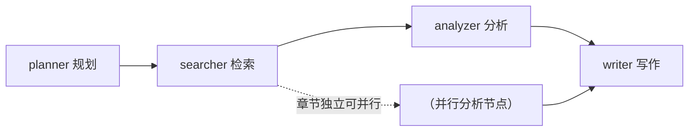
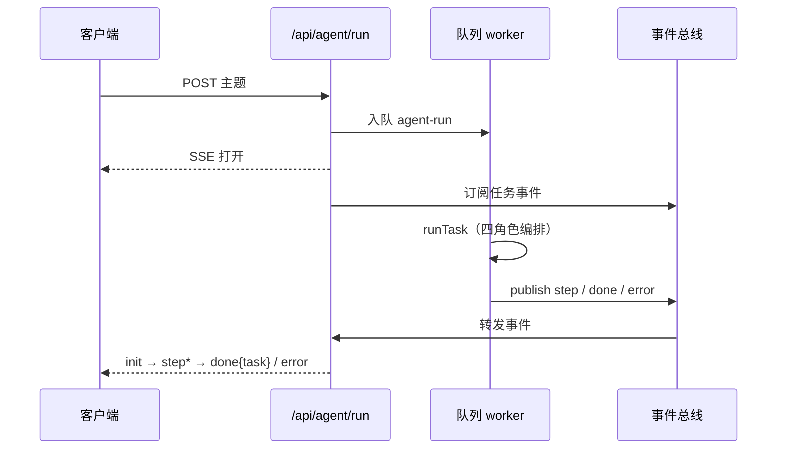

# Agent 编排架构

> 本文解释 KnowledgeAI 的 Agent 调研能力：一次「研究一个主题并生成报告」的任务如何被拆解、并行执行与流式汇报。

## 定位

`src/lib/agent/` 实现多 Agent 编排，把一次调研拆成**四个专业角色**顺序/并行执行，最终产出 Markdown 报告（支持导出 PDF / PPTX / 思维导图）：

| 角色（AgentRole） | 职责 | 产物 |
|------|------|------|
| planner（规划 Agent） | 拆解主题为若干研究子方向 | outline |
| searcher（检索 Agent） | 检索知识库 + 外部数据源（Web / ArXiv / GitHub） | 候选片段 |
| analyzer（分析 Agent） | 按章节归纳、提取关键结论与引用 | findings + citations |
| writer（写作 Agent） | 组织章节、撰写报告正文 | 报告 markdown |

## 自研 StateGraph（DAG 引擎）

编排基于 `src/lib/agent/graph.ts` 的轻量状态图引擎（LangGraph 思路的零依赖实现）：

- **节点**（NodeFn）：接收共享 `State`，返回部分状态更新（浅合并）；
- **边**（Edge）：可带条件（`when`）决定下一步；
- **执行器**：`run()` 支持拓扑排序、**并行执行**（无依赖节点并发）、`enabledNodes` 裁剪与 `maxSteps`（默认 50）防环保护。

`orchestrator.ts` 的 `buildGraph(templateId)` 依据报告模板（`templates.ts`）动态构图：`SECTIONS` 决定 planner 拆解出的子方向与 searcher/analyzer 的执行粒度；同一模板下章节之间可并行（`parallelExecuted` 标记），提升长报告生成速度。

## 任务执行与事件流

Agent 任务通过后台队列执行（`agent-run`），与请求线程解耦：

SSE 事件协议（v1 与内部一致）：

| 事件 | 载荷 | 说明 |
|------|------|------|
| `init` | `{ taskId }` | 任务已入队 |
| `step` | `{ step }`（AgentStep） | 角色进度：role / status / progress / detail / result |
| `done` | `{ task }`（AgentTask） | 任务完成，含报告内容 |
| `error` | `{ message }` | 任务失败 |

任务状态机：`queued → running → done | failed`；步骤状态：`pending → running → done | skipped`。

## 报告增强能力

`AgentTask` 模型支持完整生命周期：版本历史（`ReportVersion`）、分享配置（`ShareConfig`，公开链接 `/r/[id]`）、评论（`Comment`）、导出格式（md / pdf / pptx / mindmap）。完成后触发 `agent.completed` Webhook 事件（若已订阅）。

## 关键取舍

- **零依赖引擎**：自研 StateGraph 避免引入重框架，语义与 LangGraph 对齐，未来可平滑迁移（ROADMAP 预留接入点）；
- **模板驱动构图**：报告结构即图结构，新增报告类型只需新增模板；
- **队列 + 事件总线解耦**：worker 可与 Web 进程分离部署（Redis Pub/Sub 模式），支撑水平扩展。

## 相关文档

- [总体架构](overview.md)
- [RAG 引擎架构](rag-engine.md)
- [ADR-0002：后台任务队列](adr/adr-0002-background-job-queue.md)
- [API Agent 指南](../api/guide.md)
- [术语表](../standards/glossary.md)

## 修订记录

| 版本 | 日期 | 变更 |
|------|------|------|
| 1.0.0 | 2026-08-20 | 初版（依据 src/lib/agent 源码核对） |
