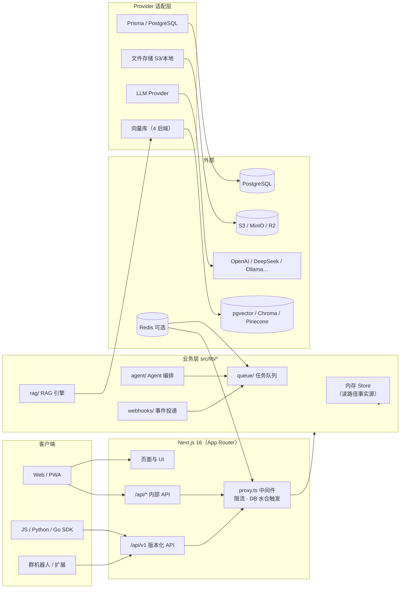

# KnowledgeAI 总体架构

> 本文解释 KnowledgeAI「为什么这样设计」。阅读后你应能回答：请求如何流动、数据存在哪里、何时用真实服务、何时回退演示模式。
>
> 相关：RAG 引擎见 [rag-engine.md](rag-engine.md)，Agent 编排见 [agent-orchestration.md](agent-orchestration.md)，对外 API 见 [../api/guide.md](../api/guide.md)。

## 架构总览

KnowledgeAI 是单仓库的全栈应用：Next.js 16（App Router）承载页面与 API，PostgreSQL（Prisma）负责持久化，Redis 可选（限流 / 队列 / 事件总线），各外部服务通过 Provider 适配层接入。

## 核心架构决策

### 1. 内存存储 + 写穿数据库（读路径事实源）

**读请求永远来自内存，数据库只负责持久化。** 每个领域模块（用户 / 知识库 / 会话 / Agent / 计费…）维护一个挂在 `globalThis` 上的内存 Store：

- **水合（hydrate）**：首个 API 请求时，将 DB 行懒加载进内存 Store（`src/lib/db/hydrate.ts`，一次性）；
- **写穿（persist）**：每次变更先写内存，再异步写穿到 PostgreSQL（`src/lib/db/persist.ts`，错误仅记录不抛出）。

为什么这样做：读路径零 DB 往返（内存 Map 查找 < 1ms），写路径对请求线程零阻塞。代价是**内存与 DB 存在短暂最终一致窗口**，且多实例部署时读仍落在各自实例内存——这是有意的取舍，详见 [ADR-0001](adr/adr-0001-in-memory-store-write-through-db.md)。

> ⚠️ **修改约束**：新增持久化实体必须同时改动 4 处：`store.ts`（内存形态）→ `persist.ts`（写穿函数）→ `hydrate.ts`（加载函数）→ `prisma/schema.prisma`（+ 新迁移）。漏掉任何一处都会造成内存与 DB 失步。

### 2. Provider 适配层：配置即切换

每个外部依赖都有「真实实现 + 演示回退」双实现（`src/lib/*/provider.ts` + `src/lib/config.ts` 聚合状态）：

| 模块 | 环境变量（示例） | 真实服务 | 未配置时回退 |
|------|------|------|------|
| LLM | `OPENAI_API_KEY` `CHAT_MODEL` | OpenAI / DeepSeek / Moonshot / 硅基流动 / Ollama | 本地抽取式生成 |
| 嵌入 | `OPENAI_API_KEY` `EMBEDDING_MODEL` | text-embedding-3-small | 本地哈希嵌入 2048 维 |
| 数据库 | `DATABASE_URL` | PostgreSQL（Prisma） | 内存模式 |
| 文件存储 | `S3_ENDPOINT` `S3_BUCKET` | S3 / MinIO / R2 | 本地文件系统 |
| 向量库 | `VECTOR_STORE` | pgvector / Chroma / Pinecone | 内存向量索引 |
| 支付 | `STRIPE_SECRET_KEY` | Stripe Checkout | 模拟支付 |
| 限流 / 队列 | `REDIS_URL` | Redis（滑动窗口 / BullMQ） | 内存限流 / 内存队列 |

管理员可在 `/admin` 面板实时查看各 Provider 启用状态。

### 3. 后台任务队列

文档处理与 Agent 调研不在请求线程执行，而是入队异步处理：

- **内存队列**（默认）：进程内，重试 3 次指数退避；
- **BullMQ + Redis**：多实例、死信队列（DLQ）、独立 worker 进程（Docker `worker` 服务）。

任务类型：`doc-process`（解析→切片→索引）、`agent-run`（runTask + 事件发布）、`index-cleanup`、`webhook-deliver`。详见 [ADR-0002](adr/adr-0002-background-job-queue.md)。

### 4. SSE 事件链路（流式体验）

问答与 Agent 进度通过 SSE 推送：`/api/chat`、`/api/v1/chat`、`/api/agent/run` 打开 SSE 连接后，worker 通过**事件总线**（内存 EventEmitter / Redis Pub/Sub）发布 `step` / `done` / `error` 事件，由 route handler 转发给浏览器。事件名（`init`/`step`/`done`）被测试断言，**不要改名**。

### 5. 分层限流

`src/proxy.ts`（Next.js 16 中间件）按请求身份分级限流，一次请求只取一个维度：

| 维度 | Key | 环境变量 | 默认（次/分） |
|------|-----|----------|------|
| 匿名 | `ip:<ip>` | `RATE_LIMIT_ANON_PER_MIN` | 20 |
| 登录用户 | `user:<userId>` | `RATE_LIMIT_PER_MIN` | — |
| API Key | `apikey:<keyId>` | `RATE_LIMIT_KEY_PER_MIN` | 500 |
| 知识库 | `kb:<kbId>` | `RATE_LIMIT_KB_PER_MIN` | 60 |

429 响应携带 `Retry-After` 与 `dimension`。SSE 与高频轮询端点（`/api/chat`、`/api/agent/run`、`/api/notifications` 等）在 `SKIP_PATHS` 中豁免。

### 6. 可观测性

- **分布式追踪**：自研 ALS（AsyncLocalStorage）span 树，覆盖 API → RAG → LLM 全链路（`X-Trace-Id` 串联）；
- **结构化日志**：pino JSON 日志，敏感字段自动脱敏，可接入 Loki；
- **健康检查**：存活探针 `/api/health` 与依赖解耦；就绪探针校验 DB / Redis / LLM 连通性，失败返回 503 并触发站内告警；
- **错误上报**：Sentry（`SENTRY_DSN` 门控）。

## 模块地图

| 模块（src/lib/） | 职责 | 文档 |
|------|------|------|
| `rag/` | 文档解析、切片、嵌入、检索、生成 | [rag-engine.md](rag-engine.md) |
| `agent/` | 多 Agent 编排（StateGraph DAG） | [agent-orchestration.md](agent-orchestration.md) |
| `queue/` | 后台任务队列与 Agent 事件总线 | [ADR-0002](adr/adr-0002-background-job-queue.md) |
| `auth/` `apikeys/` `security/` | JWT / API Key / RBAC / 2FA / GDPR | 鉴权见 [../api/guide.md](../api/guide.md) |
| `kb/` `chat/` `models/` `notifications/` | 领域业务 | — |
| `team/` `billing/` `admin/` | 协作 / 计费 / 管理 | — |
| `external/` | Web 搜索、ArXiv、GitHub 数据源 | — |
| `db/` | Prisma client / hydrate / persist / repository | [ADR-0001](adr/adr-0001-in-memory-store-write-through-db.md) |
| `storage/` `upload/` | 文件存储与分片上传 | — |
| `webhooks/` | 出站事件订阅与签名投递 | [../api/webhooks.md](../api/webhooks.md) |
| `openapi/` | OpenAPI 3.0.3 规范（v1 API 单一事实源） | [../api/reference.md](../api/reference.md) |

## 数据流示例：一次智能问答

1. 用户提交问题 → `POST /api/v1/chat`（或 Web 端 `/api/chat`）；
2. `proxy.ts` 按用户/API Key 限流；v1 路由校验 API Key scope（`chat:read`）；
3. 路由读取知识库可见性 → 组装 `RagSettings`；
4. RAG 引擎检索：查询改写 → 混合检索（向量 + BM25）→ 重排 → 父文本扩展；
5. LLM Provider 流式生成（SSE：`sources` → `token*` → `done`）；
6. 会话与消息写穿 DB；引用溯源随 `done` 事件返回。

## 相关文档

- [RAG 引擎架构](rag-engine.md)
- [Agent 编排架构](agent-orchestration.md)
- [ADR-0001：内存存储 + 写穿 DB](adr/adr-0001-in-memory-store-write-through-db.md)
- [ADR-0002：后台任务队列](adr/adr-0002-background-job-queue.md)
- [术语表](../standards/glossary.md)

## 修订记录

| 版本 | 日期 | 变更 |
|------|------|------|
| 1.0.0 | 2026-08-20 | 初版（依据 AGENTS.md 与源码核对） |
