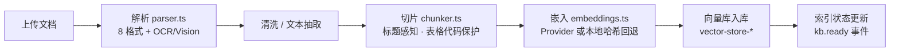
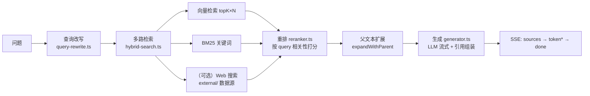

# RAG 引擎架构

> 本文解释 KnowledgeAI 的 RAG（检索增强生成）引擎：一份文档从上传到被检索回答，经历了什么；检索为什么快、为什么准；以及如何扩展。

## 定位

`src/lib/rag/` 是知识问答的核心引擎，能力覆盖：

- **多格式解析**：PDF / Word / Excel / PPT / HTML / Markdown / 纯文本 / 图片（Vision 描述 + OCR 回退）/ 视频字幕（srt/vtt）；
- **智能切片**：标题感知、表格与代码块保护；
- **向量化与多后端**：内存 / pgvector / ChromaDB / Pinecone（`VECTOR_STORE` 环境变量切换）；
- **混合检索**：向量 + BM25 关键词 + 重排（Rerank）+ 父文本扩展；
- **引用溯源**：答案内联 `[n]` 标记 + 结构化引用列表，支持负反馈降权。

## 文档处理管线（入库）

文档上传后进入后台队列（`doc-process`），执行：

核心入口：`indexDocument(doc, settings)`（`indexer.ts`）。切片参数来自 `RagSettings`（`chunkSize` / `chunkOverlap` / `topK`）。删除文档 / 知识库时，索引随清理任务自动维护。

## 检索链路（问答时）

检索入口 `retrieve(kbId, query, topK)`（`retriever.ts`）四步流水线：

1. **查询改写**（`rewriteQuery`）：将口语化问题改写为更适合检索的表述（多查询）；
2. **多路检索**（`multiQueryRetrieve`）：对每个改写查询并行执行混合检索，取更大候选池（`candidatePoolSize()` ≥ topK）；
3. **重排**（`rerank`）：用 query 与候选 chunk 的相关性打分，截取 topK；
4. **父文本扩展**（`expandWithParent`）：命中切片时回溯其父文本，补全上下文、提升回答连贯性。

## 生成与引用溯源

`generator.ts` 提供三个层次：

| 函数 | 说明 |
|------|------|
| `generate()` | 同步抽取式生成（demo 回退 / 测试用） |
| `generateAsync()` | 非流式 LLM 生成 |
| `generateStream()` | **流式生成**（生产路径）：按 token 输出，组装 `RetrievedChunk` 为 `Citation` |

`GenerationResult` 结构：`text`（含 `[n]` 内联标记）+ `citations`（`n` / `docId` / `docName` / `chunkIndex` / `snippet` / `score`）。前端据此渲染「答案 + 引用面板」。

**反馈降权闭环**：用户对回答点赞/点踩并备注 → 负反馈的 chunk 在后续检索中降权 → 检索质量随使用持续改善。

## 向量库后端（可扩展点）

| 后端 | 环境变量 | 场景 |
|------|----------|------|
| 内存（默认） | — | 演示模式、单实例 |
| pgvector | `VECTOR_STORE=pgvector` + `DATABASE_URL` | 中小规模、与主库同栈 |
| ChromaDB | `VECTOR_STORE=chromadb` | 自托管、内网 |
| Pinecone | `VECTOR_STORE=pinecone` | Serverless 大规模 |

新增后端：实现 `vector-store-interface.ts` 的接口，在 `vector-store.ts` 工厂注册即可。迁移脚本 `scripts/migrate-vector-store.ts` 可将内存索引批量导入目标后端。

## 关键取舍

- **混合检索优于纯向量**：BM25 补足实体/术语精确匹配，重排提升语义相关性，GraphRAG 实体扩展进一步提升精度（知识图谱模块）；
- **候选池放大**：检索先取大候选再重排，避免早期 topK 截断丢失相关片段；
- **本地哈希嵌入兜底**：无外部 Key 时仍可体验完整链路（精度有限，仅演示）。

## 相关文档

- [总体架构](overview.md)
- [Agent 编排架构](agent-orchestration.md)
- [API 智能问答指南](../api/guide.md)
- [术语表](../standards/glossary.md)

## 修订记录

| 版本 | 日期 | 变更 |
|------|------|------|
| 1.0.0 | 2026-08-20 | 初版（依据 src/lib/rag 源码核对） |
