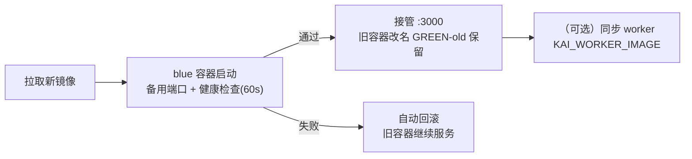

# 部署指南

> 本文介绍 KnowledgeAI 的四种部署方式与升级/回滚流程。开始前请先阅读[环境变量全表](env-vars.md)完成配置。

## 部署架构

生产部署由 **4 个服务**组成：

| 服务 | 镜像/来源 | 职责 | 说明 |
|------|-----------|------|------|
| `app` | 自建（`Dockerfile`） | Next.js standalone 服务 | 对外 :3000，生产者 |
| `worker` | 同镜像，命令 `node worker.js` | 消费队列（doc-process / agent-run / index-cleanup） | **必须部署**，否则队列任务无人处理 |
| `redis` | `redis:7-alpine` | 限流 / 队列 / 事件总线 | 可外部化（`REDIS_URL`） |
| `postgres` | `pgvector/pgvector:pg16` | 持久化 + 向量检索 | 可外部化（`DATABASE_URL`） |

**关键约束**：
- `app` 与 `worker` **共享上传目录**（`/app/.uploads` 卷），worker 需要读取 app 写入的文档文件；
- 容器内 `localhost` 是容器自己，`DATABASE_URL` / `REDIS_URL` 必须指向服务名或外部地址（见 [FAQ](../faq/faq.md)）；
- 未配置 `DATABASE_URL` / `REDIS_URL` 时应用自动回退演示模式（数据不持久化）。

## 方式一：Docker Compose（本地 / 单机）

```bash
# 1. 准备环境变量
cp .env.example .env.local
# 编辑 .env.local：至少设置 AUTH_SECRET；DATABASE_URL/REDIS_URL 留空走演示模式

# 2. 构建并启动全部服务（app + worker + redis + postgres）
docker compose up -d --build

# 3. 验证
curl http://localhost:3000/api/health        # 存活探针：{"status":"ok",...}
curl http://localhost:3000/api/health/ready  # 就绪探针：200 ok 或 503 degraded

# 4. 启用数据库持久化（可选）
docker compose exec postgres psql -U user -d knowledgeai -c "CREATE EXTENSION IF NOT EXISTS vector;"
docker compose exec app npx prisma migrate deploy
docker compose exec app npx prisma db seed   # 写入演示数据（可选）
```

- `KAI_ENV_FILE` 可指定其他环境文件（如服务器部署用 `.env`）；
- `docker compose down` 停止；数据保留在命名卷（`redis-data` / `postgres-data` / `uploads`）；
- `RATE_LIMIT_PER_MIN` 等档位可通过环境变量覆盖（性能测试需调高）。

## 方式二：Staging 自动部署（CI）

push `main` 触发 `.github/workflows/deploy.yml`：构建镜像推 GHCR → SSH 到服务器执行 `scripts/deploy/staging.sh <image> <compose-dir>`。

**前置配置**（GitHub Secrets）：`STAGING_HOST` / `STAGING_USER` / `STAGING_SSH_KEY`。未配置时 staging job 自动跳过（镜像仍构建推送）。

服务器侧 `staging.sh` 流程：
1. `docker pull` 新镜像（GHCR）；
2. 幂等拉起依赖（redis / postgres，首次自动创建）；
3. `docker compose up -d --no-deps` 更新 app + worker（`KAI_ENV_FILE` 默认 `.env`）；
4. 等待 Docker 内置 HEALTHCHECK 通过。

## 方式三：生产蓝绿部署（手动 + 审批门）

`.github/workflows/deploy-prod.yml`（workflow_dispatch 手动触发，`production` environment **必需评审人审批**）：

1. 指定镜像 tag（留空用 main 最新构建）；
2. 构建推 GHCR → SSH 执行 `scripts/deploy/blue-green.sh <image>`。

蓝绿切换逻辑（`scripts/deploy/blue-green.sh`）：



- 新版本先在备用端口健康检查通过后才接管对外端口，**不会出现新旧都不可用空窗**；
- 任一步骤失败自动回滚（退出码 1，旧版本仍在服务）；
- **回滚方式**：重新触发 workflow 并指定上一个镜像 tag。

## 方式四：Kubernetes

示例清单 `k8s/deployment.yaml`（替换镜像占位符后 apply）：

```bash
kubectl apply -f k8s/deployment.yaml
```

要点：
- **三探针语义**：`startupProbe`（启动容错）→ `livenessProbe`（`GET /api/health`，进程存活，恒 200）→ `readinessProbe`（`GET /api/health/ready`，依赖连通，503 摘流量）；
- `securityContext.fsGroup: 1001`：让 uploads PVC 可被 nextjs（uid 1001）写入，避免 EACCES；
- **worker 单独部署**（同一镜像，command 覆盖为 `node worker.js`），否则队列任务无人消费；
- uploads 卷：单节点用 ReadWriteOnce PVC；多副本建议 RWX 或对象存储。

## 升级与回滚

| 场景 | 操作 |
|------|------|
| 常规升级 | 构建新镜像 → compose 更新（方式一/二）或蓝绿切换（方式三） |
| 回滚 | 方式三：重新触发 workflow 指定旧 tag；方式一/二：`docker compose up -d <旧镜像>` |
| 数据库迁移 | 升级前执行 `npx prisma migrate deploy`（迁移文件随镜像内置） |
| 降级处理 | 演示模式与生产模式可随时互切（移除/设置 `DATABASE_URL` 即可） |

## 部署自检清单

- [ ] `AUTH_SECRET` 已设置为随机 32+ 字符
- [ ] `DATABASE_URL` / `REDIS_URL` 指向正确（容器内非 localhost）
- [ ] app 与 worker 共享 uploads 卷
- [ ] `/api/health` 与 `/api/health/ready` 探针可达
- [ ] 生产环境已配置 `production` environment 审批门与 SSH secrets
- [ ] 生产镜像 tag 可回滚（记录上次成功 tag）

## 相关文档

- [环境变量全表](env-vars.md)
- [监控与告警](monitoring.md)
- [常见问题 FAQ](../faq/faq.md) · [故障排查](../faq/troubleshooting.md)

## 修订记录

| 版本 | 日期 | 变更 |
|------|------|------|
| 1.0.0 | 2026-08-20 | 初版（依据 Dockerfile / compose / 部署脚本 / k8s 清单核对） |
